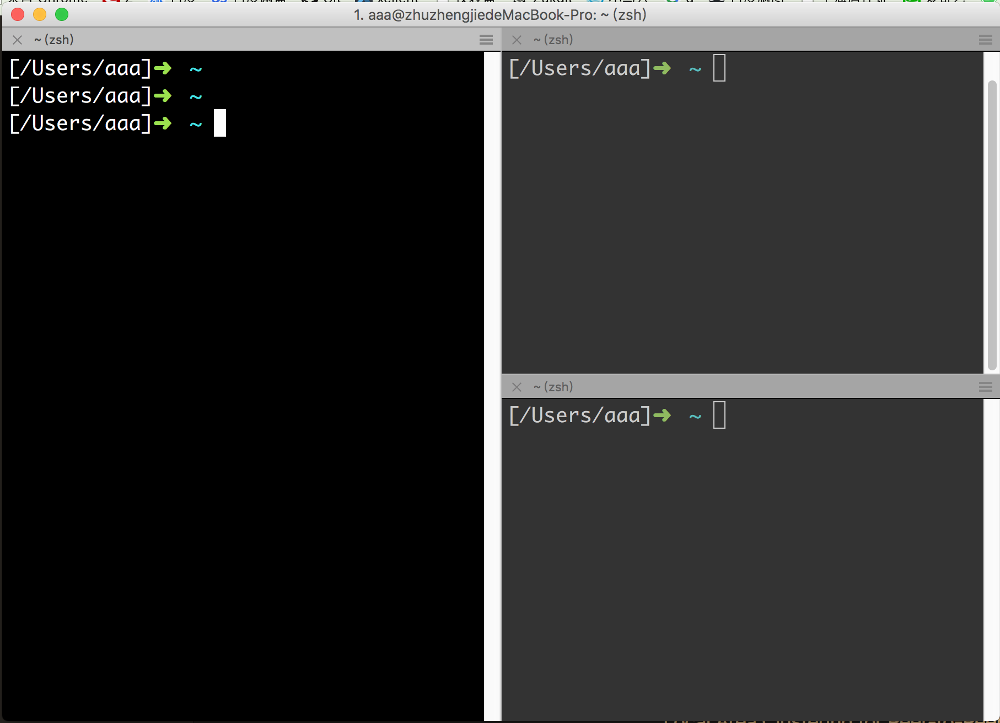

# A


## Alfred
```
地址： http://xclient.info/s/alfred.html?t=2b9e039321f36235d6854f524928c292938dfc3a
Alfred 这是一款被称之为Mac效率神器的App，有了Alfred 你甚至无需鼠标就可以实现各种操作，
包括出发各种文件、网络操作，其UI界面使用方便，而且不是通过命令来实现，
是开发者们和键盘刘童鞋们的神器，比之此前类似的软件——Pack和Power来说完全是秒杀的节奏。
Alt/option +  Space    // 打开 Alfred
```

## Axure 原型设计工具
```
地址： http://xclient.info/s/axure-rp.html?t=2b9e039321f36235d6854f524928c292938dfc3a
Axure RP 能帮助网站需求设计者，快捷而简便的创建基于网站构架图的带注释页面示
 意图、操作流程图、以及交互设计，并可自动生成用于演示的网页文件和规格文件，以提供演示与开发。
Axure RP Pro 功能包括站点地图、流程设计、页面框架设计、简单交互设 计等，
可以生成HTML、Word等格式。
```

# B
# C


## Charles
```
地址：  http://xclient.info/s/charles.html?t=2b9e039321f36235d6854f524928c292938dfc3a
Charles是一款用于HTTP信息抓包工具，可以快速有效的获得HTTP信息，
非常利于开发者的网页开发和调试修改等！
Charles 有着可视化的操作界面，非常利用编辑者的使用和调试！
```


## CodeRunner
```
地址: http://xclient.info/s/code-runner.html?t=2b9e039321f36235d6854f524928c292938dfc3a
CodeRunner for mac是Mac os平台上的一款帮助开发人员编程开发的Mac开发软件，
CodeRunner for mac是一款Mac平台上的编程开发软件，
它不需要安装额外的语言环境就可以执行一些代码， 还能立即查看运行后的效果。
可在AppleScript上编辑和运行C、C++、Java、Objective-C、Perl、PHP、Python、Ruby和Shell等代码。
```

## Cornerstone   SVN客户端
```
地址：http://xclient.info/s/cornerstone.html?t=2b9e039321f36235d6854f524928c292938dfc3a
Cornerstone for Mac乃是Mac上最佳的SVN管理工具，客户端应用程序是专门为Mac用户设计的Subversion的控制，无论您是那个版本，
或者一个Subversion的测试版，Cornerstone将有助于简化工作流程，使版本控制更加透明
```

## CrossOver
```
地址：http://xclient.info/s/cross-over.html?t=2b9e039321f36235d6854f524928c292938dfc3a
CrossOver不像Parallels或VMware的模拟器，而是实实在在Mac OS X系统上运行的一个软件。
CrossOvers能够直接在Mac上运行Windows软件与游戏，而不需虚拟机。它为Windows软件提供所需的资源，
以达到在Mac OS X系统上运行Windows程序的目的。
```

## CCleaner
```
地址： http://xclient.info/s/ccleaner.html?t=2b9e039321f36235d6854f524928c292938dfc3a
CCleaner的主要用来清,除系统不再使用的垃,圾文件，以腾出更多硬盘空间。
CCleaner的另一大功能是清,除使用者的上网记录。
CCleaner的体积小，运行速度极快，可以对临 时文件夹、历史记录、回 收站等进行垃,圾清理，
并可对注册表进行垃,圾项扫描、清 理。附带软件卸 载功能。
```

# D


## Dash
```
地址：http://xclient.info/s/dash.html?t=2b9e039321f36235d6854f524928c292938dfc3a
Dash是一个API文档浏览器（ API Documentation Browser），
以及代码片段管理工具（Code Snippet Manager）。它就只有这两个功能，但确实是程序员最为关心的特性，可以毫不夸张地说，
Dash是它们之中做的最好的一个！非常实用。从它第一版发布用到现在，绝对是一个你值得拥有的文档管理工具.
```


## Downie
```
地址： http://xclient.info/s/downie.html?t=2b9e039321f36235d6854f524928c292938dfc3a
Downie 是 Mac OS X 上的一个超级易于使用的视频下载工具，支持YouTube，Vimeo 等大部分主流视频网站。
```
# E


## Entropy 1.6.0 解压压缩工具
```
地址： http://xclient.info/s/entropy.html?t=2b9e039321f36235d6854f524928c292938dfc3a
Entropy效率不错，你可以很快的对你的文件进行解压或者压缩
Entropy同时还是一个功能强大的文档管理器，可以创建、更改、
提取许多格式的文档，包括zip，7z和tar格式，还支持rar、arj、cab、chm、cpio、cramfs、
deb、dmg、fat、flv 、hfs、iso、jar、lzh、lzma、mbr、msi、nsis、ntfs、
rar、rpm、squashfs、tar、tar.bz2、 tar.gz、udf、vhd、wim、xar、xpi、z 、zip等等。
Entropy支持预览文件包内容，支持创建多种格式的压缩文件，并支持压缩文件内容的添加和删除，支持加密，支持压缩文件内容的搜索，
```

# F
# G
# H


## Hopper Disassembler
```
地址： http://xclient.info/s/hopper-disassembler.html?t=2b9e039321f36235d6854f524928c292938dfc3a
Hopper Disassembler是一款是32位和64位的二进制反汇编器，反编译和调试。
你可以使用此工具拆开你想要的任何二进制。
```

# I
## IntelliJ  CLion  C C++
```
地址：http://xclient.info/s/clion.html?t=2b9e039321f36235d6854f524928c292938dfc3a## versions
CLion是一款专为开发C及C++所设计的跨平台IDE。它是以IntelliJ为基础设计的，
包含了许多智能功能来提高开发人员的生产力。
```

## IntelliJ Java
```
地址：http://xclient.info/s/intellij-idea.html?t=2b9e039321f36235d6854f524928c292938dfc3a
破解地址：   https://blog.csdn.net/guitarbar/article/details/81158173
IntelliJ IDEA for mac是一个综合性的Java编程环境,被许多开发人员和行业专家誉为市场上最好的IDE。

IntelliJ IDEA for mac提供了一系列最实用的的工具组合:智能编码辅助和自动控制,支持J2EE,Ant,JUnit和CVS集成。
```

## IntelliJ PyCharm  Python
```
地址：http://xclient.info/s/pycharm.html?t=2b9e039321f36235d6854f524928c292938dfc3a
PyCharm是一种Python IDE，带有一整套可以帮助用户在使用Python语言开发时提高其效率的工具，
比如调试、语法高亮、Project管理、代码跳转、智能提示、自动完成、单元测试、版本控制。
此外，该IDE提供了一些高级功能，以用于支持Django框架下的专业Web开发。
```


## IDA Pro
```
地址：http://xclient.info/s/hex-rays-ida-pro.html?t=2b9e039321f36235d6854f524928c292938dfc3a
IDA Pro已经成为事实上的分析敌意代码的标准并让其自身迅速成为攻击研究领域的重要工具。
 反编译工具，分析汇编代码
```

##  iMazing
```
地址： http://xclient.info/s/imazing.html?t=2b9e039321f36235d6854f524928c292938dfc3a
iMazing 是Mac os平台上的一款帮助用户管理手机的Mac手机助手，iMazing的能力远超iTunes。
IMazing 与你的 iOS 设备 （iPhone、 iPad 或 iPod）相连，使用起来非常的方便。
```


## iStat Menus
```
地址： http://xclient.info/s/istat-menus-for-mac.html?t=2b9e039321f36235d6854f524928c292938dfc3a
iStat Menus是Mac上最优秀的系统监控工具，能够在系统菜单栏实时监控
CPU、GPU、内存、硬盘、网络、温度、电池以及系统时间等，稳定且占用资源少，可以说是装机必备的软件。
```


## ITerm2 
```
ITerm2:  ITerm2是一个可以在一个窗口打开多个终端的软件，可以集成zsh等。


配置iterm2指导网站:   https://www.cnblogs.com/xishuai/p/mac-iterm2.html


Iterm2下载网络： 
https://www.iterm2.com/downloads.html


brew命令安装：
brew cask install iterm2


```


```
Iterm2的设置操作：

Command +  ,          // 打开Preference 设置
Command +   enter    // 全屏来回切换
Command +   d       // 左右分屏
Shift + Command +   d       //上下分屏 
Command +  ;|:     // 显示当前页面输入的历史命令
Command + K   // 清屏
Command + h    // 自动选提示
Command + f   // 在当前终端查找
Command + w    // 关闭当前的终端   command + d 打开的终端从此命令关闭 

```


```
【1】隐藏滚动条
Preferences - Appearance - Window - Hide Scrollbar  【勾选】


【2】Tab列表设置
#######################
Preferences - Appearance - Tab - show tab bar even when there is only one tab 【一个窗口有多个终端，隐藏新建一个窗口的Tab】

Preferences - Appearance - Tab -  Show tab numbers【显示窗口的索引】


Preferences - Appearance - Tab -  Show tab close buttons【是否在Tab中 显示 关闭当前窗口的按钮】


Preferences - Appearance - Tab -  Show tab close buttons【是否在全屏下  显示tab窗口栏】


Preferences - Appearance - Tab - Stretch tabs to fill bar 【是否让 当前的tab窗口栏中的tab  占据所有的tab空间】

#######################


【3】是否显示隐藏终端Terminal的标题栏
Preferences - Appearance - Panes - Show per-pane title bar with split panes 【勾选】


【4】 指定当前Shell打开的路径为指定的路径
Preferences - Profiles - Work Directory — Directory
 /Users/aaa
 
 
 【5】 指定当前Shell打开的路径为上次关闭时的路径 复用路径
 Preferences - Profiles - Work Directory —Reuse previous session's directory
 
 【6】 颜色设置
#######################
文字前景颜色设置 文字本身颜色
 Preferences - Profiles - Color -  Basic Colors -
 Foreground     00ffff    蓝靛色

选中后背景颜色
Preferences - Profiles - Color -  Basic Colors-
 Selection      dd3344    酒红色
 

shell背景颜色
 Preferences - Profiles - Color -  Basic Colors -
 Background     000000    黑色


选中后文字的前景颜色
Preferences - Profiles - Color -  Basic Colors-
 Selected Text   000000    黑色


标题Tab颜色
Preferences - Profiles - Color -  Basic Colors-
 Tab Color  88ccff  淡蓝色


光标颜色
Preferences - Profiles - Color - Cursor Color -
 Cursor    00ff00     绿色


设置光标所在行提示
Preferences - Profiles - Color - Cursor Color -
 Cursor Guide 【勾选】


主题颜色  Color Preset
#######################


【7】 光标显示的形式
Preferences - Profiles - Text - Cursor
Underline 下划线
Vertical Bar  竖标
Box   箱型


【8】字体大小 字体
Preferences - Profiles - Text - Front   18pt 
字体  Monaco


【9】窗口背景透明度
Preferences - Profiles - Window - Window Appearance
Transparency     //  背景透明度   20%
Blur             // 高斯模糊度    100%


【9】设置背景图片
Preferences - Profiles - Window - Background Image


【10】 保存配置文件JSON
Preferences - Profiles - Profiles Name -
 Default -Other Action  -- Copy Profile as Json
 // 然后 就复制JSON配置文件到剪切板

```



# J
# K
# L
# M


## Movist
```
地址： http://xclient.info/s/movist.html?t=2b9e039321f36235d6854f524928c292938dfc3a
Movist是Mac平台下一个全格式播放器,基于QuickTime & FFmpeg,
您可以选择由QuickTime 还是 FFmpeg来解码播放,支持.avi、.mkv、.wmv、flv、rmvb等格式
```


## MacDown  MarkDown软件
```
地址： http://www.pc6.com/mac/137960.html
MacDown for mac基于MAC系统免费编辑器是一款支持在Mac OSX平台下使用的编辑器工具，
很多人都知道Mac系统里的软件很多都是收费的，不过MacDown是免费并开发源代码的MarkDown编辑器，
Markdown是由John Gruber所发明的轻量级标记语言。
```

# N

## Navicat Premium
```
地址： http://xclient.info/s/navicat-premium.html?t=2b9e039321f36235d6854f524928c292938dfc3a
Navicat Premium for mac是一个可多重连接的数据库管理工具，
Navicat 的功能足以符合专业开发人员的所有需求，但是对数据库服务器的新手来说又相当容易学习。
它可让你以单一程序同時连接到目前世面上所有版本的主流数据库并进行管理和操作，支持的数据库有：
 MySQL、SQL Server、SQLite、Oracle 及 PostgreSQL。让管理不同类型的数据库更加方便。
```

# O
# P


## Password 
```
地址： http://xclient.info/s/1password.html?t=2b9e039321f36235d6854f524928c292938dfc3a
1Password 可以记住你所有的密码并保障他们的安全。你只需要记住主密码即可。
1Password 不仅可以帮你管理强且不重复的密码，更可以帮助你提升工作效率。
使用你最爱的浏览器自动登录网站一键自动填充注册表格和信用卡信息
使用 1Password 迷你随时都可快速访问你的数据
使用“前往并填充”书签可打开网页并自动填充登录信息   再亦不会因为忘记密码而浪费时间
```


## Paw
```
地址： http://xclient.info/s/paw.html?t=2b9e039321f36235d6854f524928c292938dfc3a
Paw 是一款Mac上实用的HTTP/REST服务测试工具, Paw可以让Web开发者设置各种请求Header和参数，
模拟发送HTTP请求，测试响应数据，支持OAuth, HTTP Basic Auth, Cookies，JSONP等，
这对于开发Web服务的应用很有帮助，非常实用的一款Web开发辅助工具。
```

## Parallels Desktop for Mac 
```
地址： http://xclient.info/s/parallels-desktop.html?t=2b9e039321f36235d6854f524928c292938dfc3a
Parallels Desktop for Mac 是功能最强大灵活度最高的虚拟化方案，
无需重启即可在同一台电脑上随时访问Windows和Mac两个系统上的众多应用程序。
从仅限于PC的游戏到生产力软件，Parallels Desktop都能帮您实现便捷使用。
```


## Path Finder 
```
地址：http://xclient.info/s/path-finder.html?t=2b9e039321f36235d6854f524928c292938dfc3a
Path Finder 是一款类似于Finder的系统文件管理器，它能轻而易举访问系统文件或者网络硬盘。
可自定义标签集，支持新建不同的侧边栏，根据不同的应用调取。
使用操作的确比系统自带的 Finder 操作方便多了。
```


# Q
# R
# S
## Sublime Text
```
地址： http://xclient.info/s/sublime-text.html?t=2b9e039321f36235d6854f524928c292938dfc3a
Sublime Text 是一个代码编辑器.也是HTML和散文先进的文本编辑器。
漂亮的用户界面和非凡的功能，例如迷你地图，多选择，Python的插件，代码段，等等
```

## SourceTree
```
地址：  http://xclient.info/s/sourcetree.html?t=6aaaaefb3343e36bd3e93dc357846e131708b315## versions
SourceTree  是Git版本管理工具 ， 提交历史
```

# T

## Transmit
```
地址： http://xclient.info/s/transmit.html?t=2b9e039321f36235d6854f524928c292938dfc3a
Transmit是一款功能齐全的FTP客户端。兼容FTP，SFTP和TLS/SSL协议，
提供比Finder更加迅速的iDisk账户接入
```


## Tower git客户端
```
地址： http://xclient.info/s/tower.html?t=2b9e039321f36235d6854f524928c292938dfc3a
Tower 是一款非常强大的Git客户端，如果你使用git的过程中，感觉使用命令很困难，
可以尝试使用Tower。它采用了分布式版本库的方式，不必服务器端软件支持，
使源代码的发布和交流极其方便。
```


## TotalFinder
```
地址:   http://xclient.info/s/totalfinder.html?t=2b9e039321f36235d6854f524928c292938dfc3a
TotalFinder 是Mac上最好用的Finder增强工具，
TotalFinder 提供了多标签式浏览、拷贝路径、剪切文件、显示隐藏文件、双栏窗口模式、彩色标签等功能
安装方法：在安装 TotalFinder 之前先必须先关闭SIP ，方法是关机重启Command+R进入Recovery模式 打开终端输入如下命令：
csrutil disable   关闭SIP 然后重启进入系统安装。
csrutil enable --without debug   打开保护SIP 然后重启进入系统安装。

License Name: Kevin Kelley
License Key: GAWAE-FBZK3-X4M62-5L9UJ-JLGUL-A6LCG-MBLQT-S9HQC-CRN99-JC7GB-FRFDZ-WCDYZ-DFPRA-5LD2R-CLLM
```


# U


## Understand
```
地址： http://xclient.info/s/understand.html?t=2b9e039321f36235d6854f524928c292938dfc3a
Understand是一款定位于代码阅读的软件。界面用Qt开发的，支持多语言、多平台，内置的目录和文件比较器。
```


## Ultraedit
```
地址： http://xclient.info/s/ultraedit.html?t=2b9e039321f36235d6854f524928c292938dfc3a
Ultraedit是一款在Windows系统中非常出名的文本编辑器，
可以编辑文本、十六进制、ASCII 码，完全可以取代其他文本工具，同时还支持许多开发语言
```

## UninstallPKG
```
地址：http://xclient.info/s/uninstall-pkg.html?t=2b9e039321f36235d6854f524928c292938dfc3a
UninstallPKG Mac版是一款Mac平台的 
pkg文件彻底删除工具，可以帮助我们一键彻底删除安装在我们Mac电脑上的
```


# V

## VirtualBox VMs
```
VirtualBox VMs   // 在shell中打开VM


```

## VLC
```
VLC 视频播放器 // 可在命令行执行

下载地址： http://www.pc6.com/mac/112121.html
```

# W
# X


## XMind Pro
```
地址：  http://xclient.info/s/xmind.html?t=2b9e039321f36235d6854f524928c292938dfc3a## versions
XMind是一款实用的思维导图软件,简单易用、美观、功能强大,拥有高效的可视化思维模式,
具备可扩展、跨平台、稳定性和性能,真正帮助用户提高生产率,促进有效沟通及协作。
```

# Y
# Z