# A

## Alias命令
```

alias suz="/usr/local/sh_expect_work/suz.sh"
alias cmt="/usr/local/sh_expect_work/cmt.sh"
alias cdsh='cd /usr/local/sh_expect_work/'
alias cdgit='cd  /Users/aaa/Desktop/code_place/zzj_git/'

```

## aalib库-aview库

```
详细说明： https://blog.csdn.net/exbob/article/details/7321903
aalib简介：aalib这是一个功能库  目的是将计算机上的一切都用ASCII字符来表现，包括图形和视频

aview简介：aview程序可以将pbm、pgm或pnm图片用ASCII字符显示。但是不支持JPEG图片，所以它提供了一个shell脚本asciiview，先调用convert将JPEG图片转换为pgm图片，然后再用aview显示。
convert 功能依赖于包 imagemagick  所以还要下载该包
安装方法( Mac )： 
brew install  aalib
brew install  aview
brew install  imagemagick


命令： asciiview ./1.png
```


## ACK命令
```
简介：ack诞生的目的就是要取代grep，从作者开发的初衷以及它官网的名字，另外它还有一个“可以替代99%grep的工作”这个口号。ACK专门为
程序员进行搜索进行了优化

特点：
1.速度非常快,因为它只搜索有意义的东西。
2.更友好的搜索，忽略那些不是你源码的东西。
3.为源代码搜索而设计，用更少的击键完成任务。
4.非常轻便，移植性好。
5.免费且开源

与grep对比：
grep常用操作
grep -r 'hello_world' # 简单用法
grep '^hello_world' . # 简单正则
ls -l | grep .py      # 管道用法

grep的一些参数：
-c(统记 搜索结果)/ -i(忽略大小)/ -h(不显示名称)/  -C(显示行数)
-l(只显文件名)/ -n(加行号)/ -v(显示不匹配)  / -s (no-messages不显示错误信息)
-r (表示在当前目录和子目录，循环搜索)


ack功能划分:
1. Searching代码搜索
2. Search output搜索结果处理
3. File presentation文件展示
4. File finding文件查找
5. File inclusion/exclusion文件过滤


ack 参数用法：默认是递归
-i         忽略大小写
-v        显示不匹配行
-w        强制匹配整个单词
-l         打印匹配的文件名
-L        打印不匹配的文件名
-m       在每个文件中最多匹配多少行就停止搜索
-c        显示匹配的总行数

ack -i -w eat   // 在当前目录递归搜索单词”eat”,不匹配类似于”feature”或”eating”的字符串
ack -i  --php  protected   //忽略大小写搜索php文件中包含protected的文件
ack -f hello.py     // 查找多有匹配的文件   hello.py

ack --python hello     //查找所有包含hello字符串的python文件 

ack --java zukgit     // 检查所有包含 zukgit字符串的文件

```

## ADB 命令

```

adb shell setprop vidc.debug.level 7 


adb shell tcpdump -i any -p -s 0 -w /data/op_pcap.pcap
```


## Afl-fuzz库命令
```
简介： https://blog.csdn.net/youkawa/article/details/45696317
AFL(American Fuzzy Lop)是由Google安全工程师Micha  Zalewski开发的一款开源fuzzing测试工具，可以高效地对【二进制程序】进行【fuzzing模糊测试】，挖掘可能存在的内存安全漏洞，如栈溢出、堆溢出、UAF、double free等。由于需要在相关代码处插桩，因此AFL主要用于对开源软件进行测试。当然配合QEMU等工具，也可对闭源二进制代码进行fuzzing，但执行效率会受到影响。

AFL主要由3部分组成：
编译器wrapper，该部分用于编译目标代码，如afl-gcc, afl-clang等
fuzzer: afl-fuzz，即为用于fuzzing的主要工具
其他工具：如afl-cmin, afl-tmin等


Fuzzing技术被证明是当前鉴别软件安全问题方面最强大测试技术。

```


## aircrack-ng 破解WIFI的WEP/WPA/WPA2密码的主流工具
```
Aircrack-ng是一套套件包含的工具可用于捕获数据包、握手验证。可用来进行暴力破解和字典攻击。
Aircrack-ng 攻击 主要是拿到握手包，用字典破解握手包

作用领域：
监控：数据包捕获并将数据导出到文本文件以供第三方工具进一步处理。
攻击：通过数据包注入重播攻击，解除身份验证，假接入点和其他攻击点。
测试：检查WiFi卡和驱动程序功能（捕获和注入）。
破解：WEP和WPA PSK（WPA 1和2） 


使用：
// 1.使用该命令 查看周围wifi网络的 SSID热点名 BSSID热点唯一Mac标识            
//   RSSI信号强度  CHANNEL信道  HT CC SECURITY加密方式 (auth/unicast/group)
【配置airport 链接到 bin 使得 shell中能找到】
sudo ln -s /System/Library/PrivateFrameworks/Apple80211.framework/Versions/Current/Resources/airport /usr/sbin/airport

airport -s     


//2. en0表示当前的网卡名 ifconfig命令查看 6表示当前探测的网络工作的信道channel
// 该命令开始执行抓取在该信道传输的WIFI帧   Ctrl + C 结束该过程
//会生成 /tmp/airportsniffXXX.cap(或者/private/tmp/airportsniffXXX.cap) 捕获帧文件
airport en0 sniff 6 


// 3.复制该文件到 zidian.txt(里面包含穷举的密码)统一文件夹下 改名为 1.cap 并在shell界面cd到该目录  执行查找握手帧的过程
aircrack-ng -w zidian.txt 1.cap

//4.在出现的帧编号中 查找一个描述为 WPA( 1 handshake ) 的帧 , 并输入该帧对应的 帧编号开始解析
//等待字典.txt中所有的Item进行破解，如果字典.txt存在密码就会破解成功，若不存在则需要更换破解字典.txt文件 
```
**检测网络信息**
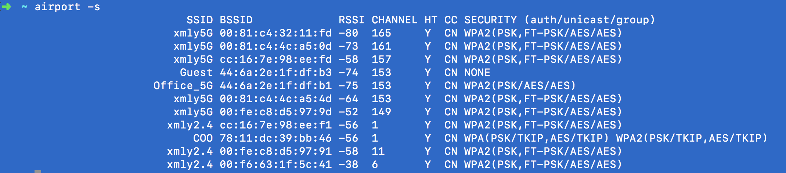

**选择捕获帧中显示（1 handshake）的帧**
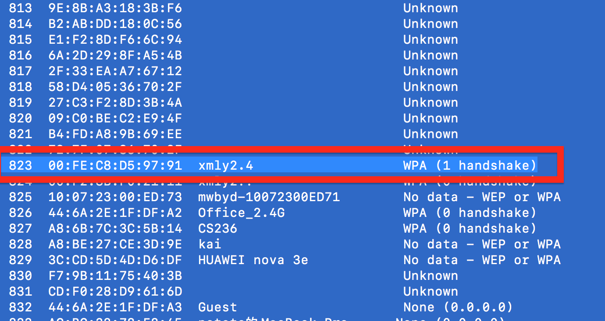
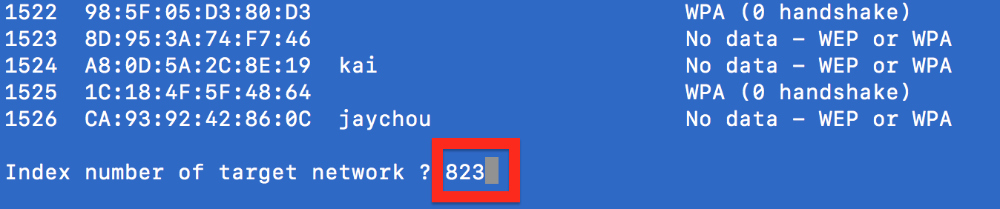

**字典中未包含枚举密码解析失败**
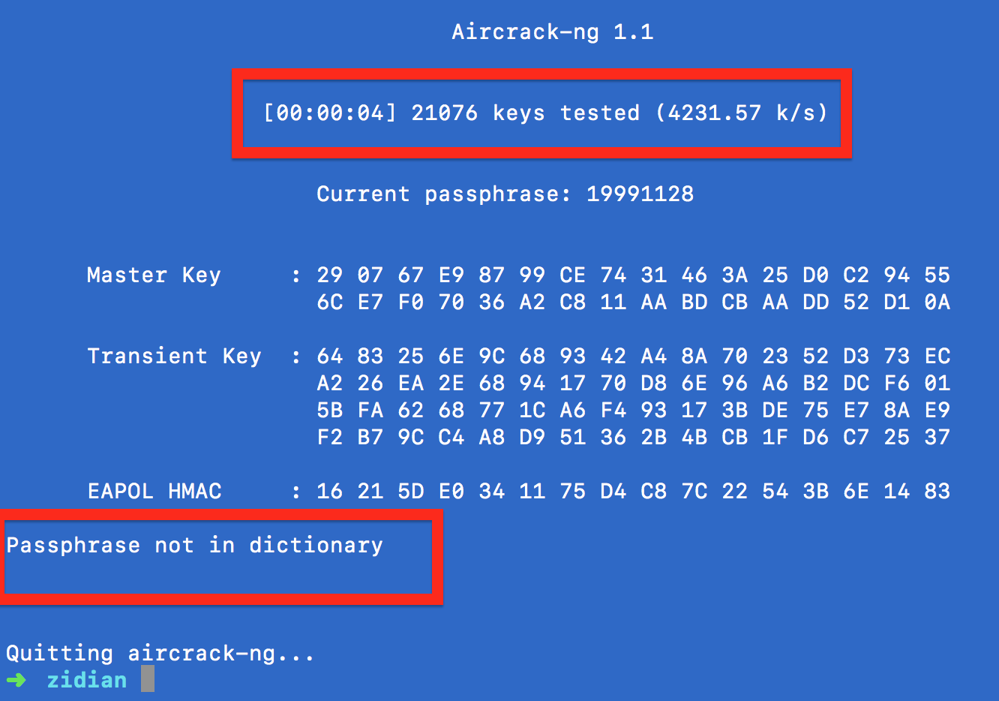

**字典中包含密码解析成功**
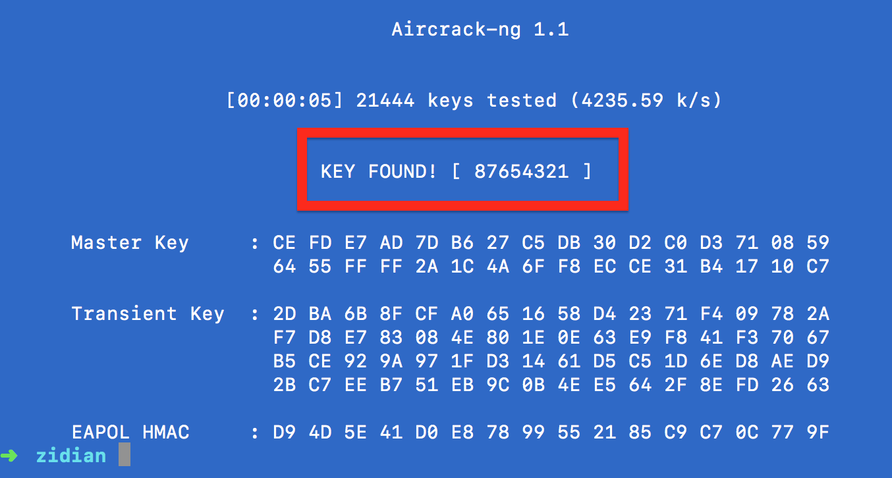


## antigen 工具
```
antigen简介:
Zsh 是一个 Linux 下强大的 shell, 由于大多数 Linux 产品安装，以及默认使用 bash shell, 但是丝毫不影响极客们对 zsh 的热衷, 几乎每一款 Linux 产品都包含有 zsh，通常可以用 apt-get、urpmi 或 yum 等包管理器进行安装。虽然说 Zsh 是开箱即用，但是为了更好用，还是需要一些定制化的配置。之前一直使用 oh-my-zsh , oh-my-zsh 把主题、插件等都是一起管理的，但是很多其他的主题和插件，且都是由不同的作者开发的，这样的话，管理起来就比较麻烦。 antigen 就是针对此问题，应运而生。antigen是zsh的包管理器，让我们以类似apt-get的方式来安装zsh功能，非常方便。


安装命令(Mac)： brew install antigen

```

```
antigen 的命令(用法):


antigen  apply       -- 该命令会应用所有之前所做的更改。使得加载的插件生效 Load all bundle completions

antigen bundle  xxxx插件名称|url地址     -- 该命令用于下载和安装插件如果插件已安装那么就加载该插件 Install and load the given plugin
antigen bundle git
antigen bundle heroku
antigen bundle pip
antigen bundle lein
antigen bundle command-not-found
antigen bundle zsh-users/zsh-syntax-highlighting  #语法高亮功能
antigen bundle zsh-users/zsh-autosuggestions   #代码提示功能
antigen bundle zsh-users/zsh-completions   #自动补全功能

antigen  cache-gen   -- 把当前加载的插件生成缓存，可以加快之后的加载过程 Generate cache
antigen  cleanup     -- 清除所有插件多余的版本Clean up the clones of repos which are not used by any bundle
antigen  help        -- Show this message 帮助手册
antigen  init  ~/.antigenrc    -- 该命令可以指定一个antigen配置文件  使用该配置文件来初始化 antigen


antigen  list        -- 查看当前插件集合List out the currently loaded bundles
【
[zukgit的MacPro-/Users/aaa]➜  ~ antigen  list
robbyrussell/oh-my-zsh ~ lib @ master
robbyrussell/oh-my-zsh ~ plugins/git @ master
robbyrussell/oh-my-zsh ~ plugins/heroku @ master
robbyrussell/oh-my-zsh ~ plugins/pip @ master
robbyrussell/oh-my-zsh ~ plugins/lein @ master
robbyrussell/oh-my-zsh ~ plugins/command-not-found @ master
zsh-users/zsh-syntax-highlighting @ master
zsh-users/zsh-autosuggestions @ master
zsh-users/zsh-completions @ master
robbyrussell/oh-my-zsh ~ themes/Fishy2.zsh-theme @ master
】

antigen purge xxxx插件  --清理插件多余的版本Remove a cloned bundle from filesystem
antigen purge   robbyrussell/oh-my-zsh             
antigen purge   zsh-users/zsh-completions        
antigen purge   zsh-users/zsh-autosuggestions      
antigen purge   zsh-users/zsh-syntax-highlighting


antigen  reset       -- Clears cache 清理缓存

antigen  restore     -- Restore the bundles state as specified in the snapshot
antigen  revert      -- 还原？  不懂

antigen selfupdate  -- Update antigen itself 更新antigen自身
antigen snapshot    -- Create a snapshot of all the active clones
antigen  theme  awesomepanda      -- Switch the prompt theme
antigen  theme  xxxxxx     // 切换主题
antigen  update      --  执行更新插件  Update all bundles
antigen  use  oh-my-zsh
antigen  use  prezto   -- Load any (supported) zsh pre-packaged framework
antigen  version     -- Display Antigen version

```


```
cat ~/.zshrc 【zsh的配置文件如下】  antigen是下.zshrc脚本执行命令的方式实现对zsh的管理 
-------------------------------------------------------------


export ZSH=$HOME/.oh-my-zsh
ZSH_THEME="robbyrussell"

plugins=(git)

source $ZSH/oh-my-zsh.sh
source $HOME/.bash_profile

###############客制化#################
##设置 sh 脚本执行的命令别名
alias suz="/usr/local/sh_expect_work/suz.sh"
alias cmt="/usr/local/sh_expect_work/cmt.sh"
alias cdsh='cd /usr/local/sh_expect_work/'
alias cdgit='cd  /Users/aaa/Desktop/code_place/zzj_git/'
alias cls="clear"

## 把root的bin路径加入到 PATH变量中
export PATH="/usr/local/sbin:$PATH"


## 执行antigen 用于初始化 antigen的环境
source /usr/local/share/antigen/antigen.zsh

## 通过 antigen 加载 oh-my-zsh库
antigen use oh-my-zsh

## 加载原版oh-my-zsh中的功能
antigen bundle git
antigen bundle heroku
antigen bundle pip
antigen bundle lein
antigen bundle command-not-found


antigen bundle zsh-users/zsh-syntax-highlighting  #语法高亮功能
antigen bundle zsh-users/zsh-autosuggestions   #代码提示功能
antigen bundle zsh-users/zsh-completions   #自动补全功能

##zsh主题地址    https://github.com/robbyrussell/oh-my-zsh/wiki/External-themes
##zsh主题地址    https://github.com/robbyrussell/oh-my-zsh/wiki/themes
antigen theme Fishy2   # 加载主题为 Fishy2

antigen apply     # 保存当前设置 并进行生效设置

#修改 shell的行提示符
PS1="[zukgit的MacPro-\`pwd\`]${ret_status} %{$fg[cyan]%}%c%{$reset_color%} $(git_prompt_info)"


```

```
【个人配置】
1. 终端 》 偏好设置 》 通用tab 》 使用描述文件新建窗口dropdown 》 选中 Homebrew
2. 终端 》 偏好设置 》 描述文件tab 》 Homebrew 》字体 18pt    颜色 绿色 green
```
 
```
【解决打开两个shell窗口应用主题不一致的问题】
打开Shell 》 Shell【menu】 》 将设置用作默认设置


```


```
zsh 快捷键：
Command + T    //  当前窗口打开一个新的tab页 
Ctrl + Tab    // 在打开的Tab之间切换

Command + N   //  新创建一个 Shell窗口
Command +  1    // 在新创建的 Shell窗口进行切换  
Command +  2  
Command +  3


Command + Q  // 强制关闭窗口 所有的窗口
Command + W  // 关闭当前窗口
Command + K   // 清理屏幕
Command + H   // 窗口最小化
```
** Homebrew主题 18pt字体的shell**
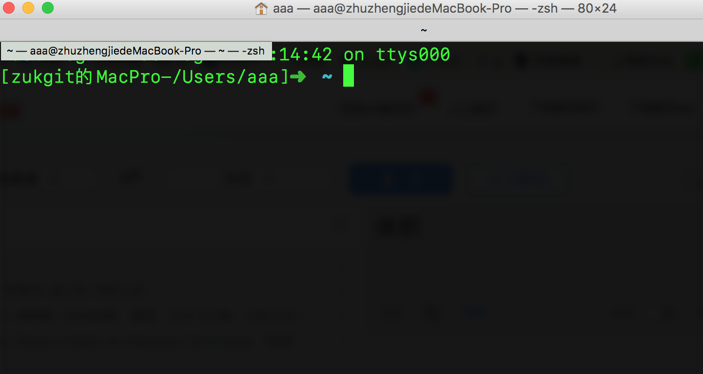


## antiword 工具
```
antiword 是一个可以把doc文件中的字符串进行输出的工具。
antiword 是linux及其他RISC OS下免费的ms word文档读取器。使用它可以很方便的在Linux中读取word文档并输出为纯文本字符串。 其中的非字符串部分被过滤了。


官网： http://www.winfield.demon.nl/#Mac%20OS%20X

```

```
用法：   antiword    xxxxx.doc
// 例如：      antiword   ./1.doc

```
**doc 文件**
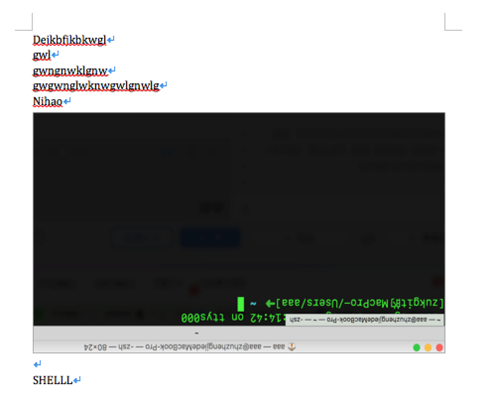
**antiword读取的字符串**
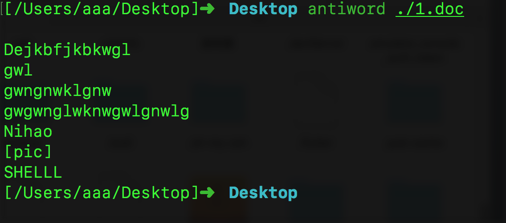


## apktool 工具
```
apktool作用: 主要查看res文件下xml文件、AndroidManifest.xml和图片。（注意：如果直接解压.apk文件，xml文件打开全部是乱码）
apktool下载地址： https://ibotpeaches.github.io/Apktool/install/

apktool 安装命令( Mac ):   brew install apktool

命令:  apktool d app.apk    【 java -jar apktool.jar d yourApkFile.apk 】
```


```
apktool.jar的 使用方法:
1. 将下载的 apktool_2.3.3.jar  名字改为  apktool.jar
2. 运行CMD，把 app.apk放到所在目录，然后运行apktool d app.apk 【apk文件名字】就可以了，默认解压的文件就在app-release.apk所在目录。
  例如 [ apktool d bibibi.apk ]


java -jar apktool.jar d yourApkFile.apk
// 注意`apktool.jar`是刚才下载后的jar的名称，`d`参数表示decode
// 在这个命令后面还可以添加像`-o -s`之类的参数，例如
// java -jar apktool.jar d yourApkFile.apk -o destiantionDir -s
// 几个主要的参数设置方法及其含义：
-f 如果目标文件夹已存在，强制删除现有文件夹
-o 指定反编译的目标文件夹的名称（默认会将文件输出到以Apk文件名命名的文件夹中）
-s 保留classes.dex文件（默认会将dex文件解码成smali文件）
-r 保留resources.arsc文件（默认会将resources.arsc解码成具体的资源文件）


```

```
apktool命令：

//  都是显示  apktool 详细用法  
apktool  -advance     //  显示  apktool 详细用法  
apktool  --advanced   //  显示  apktool 详细用法  
apktool  -v
apktool  -q
apktool  --quiet
apktool  --quiet 
apktool  --verbose  //  显示  apktool 详细用法  


apktool d ./yourApkFile.apk    // 解析当前apk的xml文件 和 图片 （注意：如果直接解压.apk文件，xml文件打开全部是乱码）


```

**apktoll d xxx.apk 命令**
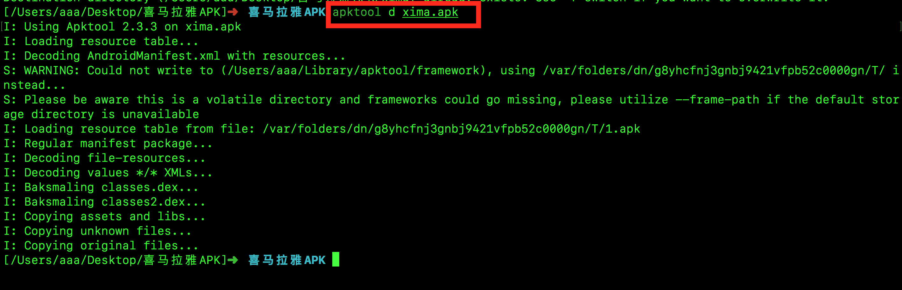
**antiword读取的字符串**
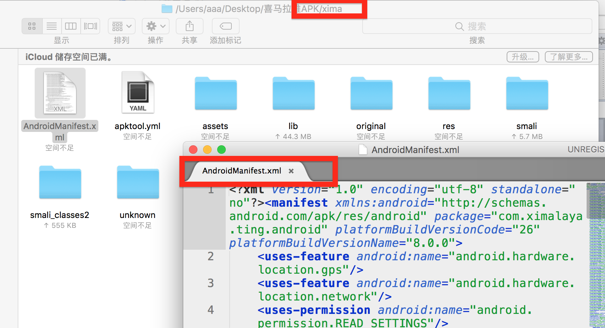

## apng2gif 工具
# B

## brew | homebrew  (Mac-Shell专用)
```
【官网】    https://brew.sh/index_zh-cn
【可安装包】  https://formulae.brew.sh/formula/
【安装命令】
ruby -e "$(curl -fsSL https://raw.github.com/mxcl/homebrew/go)"


【常用命令】
brew search  xxxx          //  xxxx 表示你想要搜的软件包  brew search  abcde 

brew install xxxx软件包        //安装 软件包   例如： brew install wget
brew uninstall xxxx软件包       //  卸载软件包  

brew list                   //  显示安装软件列表
brew ls                   //  显示安装软件列表
brew desc  xxxx包名    // 显示安装包的描述作用   brew desc  git

brew  deps   xxxx包名      【显示一个安装包的依赖关系】  【例如: brew  deps  wget 】


brew  config        // 显示 homebrew的配置
brew  home         // 进入 homebrew官网

```


```
[brew 命令简介集合]
    
brew --cache     【/Users/aaa/Library/Caches/Homebrew】-- brew cache

brew --cellar    【/usr/local/Cellar】 -- brew cellar

brew --env         
【HOMEBREW_CC: clang
HOMEBREW_CXX: clang++
MAKEFLAGS: -j8
CMAKE_PREFIX_PATH: /usr/local
CMAKE_INCLUDE_PATH: /usr/include/libxml2:/System/Library/Frameworks/OpenGL.framework/Versions/Current/Headers
CMAKE_LIBRARY_PATH: /System/Library/Frameworks/OpenGL.framework/Versions/Current/Libraries
PKG_CONFIG_LIBDIR: /usr/lib/pkgconfig:/usr/local/Homebrew/Library/Homebrew/os/mac/pkgconfig/10.12
ACLOCAL_PATH: /usr/local/share/aclocal
PATH: /usr/local/Homebrew/Library/Homebrew/shims/mac/super:/usr/bin:/bin:/usr/sbin:/sbin】  
-- brew environment


brew --prefix      【/usr/local】-- where brew lives on this system

brew --repository   【/usr/local/Homebrew】  -- brew repository

brew --version     
【Homebrew 1.6.17
Homebrew/homebrew-core (git revision ddb17a; last commit 2018-08-12)】
 -- version information
 
 
brew audit         -- check formulae for Homebrew coding style
brew cat git  【显示安装包的详细信息】    -- display formula file for a formula
brew cleanup   【卸载不使用的旧的包】 -- uninstall unused and old versions of packages
brew commands     【显示多有的brew 内部可执行命令】 -- show a list of commands


brew  config       【显示 brew的配置 以及一些系统配置】
【HOMEBREW_VERSION: 1.6.17
ORIGIN: https://github.com/Homebrew/brew.git
HEAD: 526bece65feca74bf9cdc7f88b37e9a58548b09a
Last commit: 4 weeks ago
Core tap ORIGIN: https://github.com/Homebrew/homebrew-core
Core tap HEAD: ddb17a02ea1147ad63c3cac586fc492d7d0c30bb
Core tap last commit: 22 hours ago
HOMEBREW_PREFIX: /usr/local
HOMEBREW_DEV_CMD_RUN: 1
CPU: octa-core 64-bit ivybridge
Homebrew Ruby: 2.3.7 => /usr/local/Homebrew/Library/Homebrew/vendor/portable-ruby/2.3.7/bin/ruby
Clang: 9.0 build 900
Git: 2.17.0 => /usr/local/bin/git
Curl: 7.54.0 => /usr/bin/curl
Java: 1.8.0_141
macOS: 10.12.6-x86_64
CLT: 9.2.0.0.1.1510905681
Xcode: 9.2
XQuartz: N/A】 -- show homebrew and system configuration


brew  create       【创建一个命令方案?  不会用到的~】 -- create a new formula


brew  deps   xxxx包名      【显示一个安装包的依赖关系】  
【例如: brew  deps  wget
gettext
libidn2
libunistring
openssl 】
 -- list dependencies of formulae
 
 
 
brew desc  xxxx包名    
【例如  brew desc  wget   wget: Internet file retriever】
【例如 brew desc  git   git: Distributed revision control system 】
-- display a description of a formula
         


brew doctor    【检查安装包】    -- audits your installation for common issues
brew  edit          【 编辑安装包】-- edit a formula
brew fetch xxxx包名  【下载安装包到cache目录  不安装】        -- download formula resources to the cache

brew formula     
【显示安装包的安装路径】
【brew formula  git
/usr/local/Homebrew/Library/Taps/homebrew/homebrew-core/Formula/git.rb】
  -- the path for a formula
  
  
brew  gist-logs  xxxx安装包   【brew  gist-logs git 显示安装的Log信息】    -- generate a gist of the full build logs

brew home        【在浏览器打开homebrew的主页】  -- visit the homepage of a formula or the brew project

brew info  xxxx安装包   
【 查看安装包的消息信息 包括 desc描述 】        -- information about a formula

brew  install  xxxx安装包       【安装包 到本地系统  如：brew info  git         brew info  wget】
-- install a formula


brew leaves      
【显示已安装包中不依赖其他安装包的软件】 
【例如：    brew leaves 
aircrack-ng       automake     cocoapods
git        ideviceinstaller     ios-deploy
iperf      libtool     pkg-config    wget】
 -- show installed formulae that are not dependencies of anothe
 
 
brew  link  xxxx安装包  【测试安装包连通性】      -- link a formula


brew list      同  brew  ls   【查看已安装软件包】
【  例如： brew list
aircrack-ng		iperf			libxml2
autoconf		libidn2			libzip
automake		libimobiledevice	openssl
cocoapods		libplist		pkg-config
gettext			libtasn1		readline
git			libtool			sqlite
ideviceinstaller	libunistring		usbmuxd
ios-deploy		libusb			wget】
 -- list files in a formula or not-installed formulae


brew  log        【查看homebrew 这个工具库的git提交记录】  -- git commit log for a formula


brew migrate     【修改一个安装包的名称?】  -- migrate renamed formula to new name

brew missing     【检查所有已安装 但失去依赖关系的包】     -- check all installed formuale for missing dependencies.


brew outdated  【显示所有已安装包的服务器最新版本】    
【brew outdated ：
aircrack-ng (1.1_2) < 1.3
automake (1.15.1) < 1.16.1
cocoapods (1.3.1) < 1.5.3
git (2.17.0) < 2.18.0
ideviceinstaller (1.1.0_3) < 1.1.0_4
libtasn1 (4.12) < 4.13
libusb (1.0.21) < 1.0.22
libxml2 (2.9.4_4) < 2.9.7
libzip (1.2.0) < 1.5.1
readline (7.0.3_1) < 7.0.5
sqlite (3.19.3) < 3.24.0 】
-- list formulae for which a newer version is available


brew pin  xxxx安装包           【暂停安装包 安装过程  例如：brew pin  git】-- pin specified formulae
brew postinstall  xxxx安装包  【安装向导?】 -- perform post_install for a given formula
brew prune         【移除 那些不起作用的 链接Link 在安装 homebrew的目录】 -- remove dead links

brew reinstall  xxxx安装包   【更新已经安装的安装包】-- install a formula anew; re-using its current options

brew remove  xxxx安装包      【移除一个安装包】      -- remove a formula

brew  search  xxxx安装包    【搜索安装包】      -- search for a formula (/regex/ or string)

brew  switch  xxxx安装包 【在已安装的相同软件不同版本间切换】      -- switch between different versions of a formula

brew tap         【可以为brew的软件的 跟踪,更新,安装添加更多的的tap formulae】 
https://segmentfault.com/a/1190000012826983    【homebrew的tap功能详解】
 -- tap a new formula repository from GitHub, or list existing 
 
 
brew tap-info      【显示 tab 信息】-- information about a tap
【 brew tap-info 
2 taps, 0 pinned, 0 private, 4611 formulae, 3 commands, 9,165 files, 181.4MB 】 


brew  uninstall  xxxx安装包  【 卸载安装包 】  -- uninstall a formula   


brew  update     【下载所有的新的安装包】   -- fetch latest version of Homebrew and all formulae

brew upgrade   【升级安装所有的本地安装包对应的服务器新版本】     -- upgrade outdated formulae

brew  uses  xxxx安装包    【查看所有依赖指定包的其他安装包】     
【brew  uses wget
dasht               jigdo               luaver              wgetpaste】
-- show formulae which depend on a formula

 brew  analytics   【统计？】
【
Analytics is enabled.
UUID: 167DFEA1-3D1B-48B3-8025-1380F6630017
】

 brew  irb   【进入 brew自己的shell】

```

```
[homebrew 能安装的软件集合   4628个]
a2ps                        a52dec                            aacgain                        aalib                         
aamath                      aap                               aardvark_shell_utils           abcde                         
abcl                        abcm2ps                           abcmidi                        abduco                        
abnfgen                     abook                             abuse                          abyss                         
ace                         aces_container                    ack                            acme                          
acmetool                    acpica                            activemq                       activemq-cpp                  
admesh                      adns                              adplug                         adr-tools                     
advancecomp                 advancemame                       advancemenu                    advancescan                   
adwaita-icon-theme          aescrypt                          aescrypt-packetizer            aespipe                       
afflib                      afio                              afl-fuzz                       afsctool                      
aften                       afuse                             agda                           agedu                         
aggregate                   aha                               ahcpd                          aiccu                         
aide                        aircrack-ng                       airspy                         akamai                        
akka                        alac                              aldo                           alexjs                        
algernon                    algol68g                          align                          allegro                       
allure                      alluxio                           alot                           alpine                        
alure                       amap                              amazon-ecs-cli                 amber                         
amdatu-bootstrap            ammonite-repl                     ampl-mp                        amqp-cpp                      
amtk                        amtterm                           analog                         angband                       
angle-grinder               angular-cli                       anjuta                         annie                         
ansible                     ansible-cmdb                      ansible-lint                   ansible@1.9                   
ansible@2.0                 ansifilter                        ansiweather                    ant                           
ant-contrib                 ant@1.9                           antigen                        antiword                      
antlr                       antlr4-cpp-runtime                antlr@2                        anttweakbar                   
aoeui                       apache-archiva                    apache-arrow                   apache-arrow-glib             
apache-brooklyn-cli         apache-ctakes                     apache-drill                   apache-flink                  
apache-forrest              apache-geode                      apache-opennlp                 apache-spark                  
apache-zeppelin             apachetop                         apcupsd                        ape                           
apel                        apgdiff                           apib                           apibuilder-cli                
apktool                     apm-bash-completion               apm-server                     apng2gif                      
apngasm                     apollo                            app-engine-java                app-engine-python             
apparix                     apple-gcc42                       appledoc                       appscale-tools                
apr                         apr-util                          apt-dater                      aptly                         
aptly-completion            aqbanking                         arabica                        arangodb                      
arcade-learning-environment archey                            archi-steam-farm               archivemail                   
archivemount                argon2                            argp-standalone                argtable                      
argus                       argus-clients                     argyll-cms                     aria2                         
ark                         arm-linux-gnueabihf-binutils      armadillo                      armor                         
arp-scan                    arp-sk                            arpack                         arping                        
arpoison                    arss                              artifactory                    artifactory-cli-go            
arx                         arx-libertatis                    ascii                          asciidoc                      
asciidoctor                 asciidoctorj                      asciinema                      asciinema2gif                 
asciiquarium                asciitex                          asdf                           asio                          
ask-cli                     asn1c                             aspcud                         aspectj                       
aspell                      assh                              assimp                         astyle                        
at-spi2-atk                 at-spi2-core                      atari800                       atdtool                       
aterm                       atf                               atk                            atkmm                         
atlassian-cli               atomicparsley                     atool                          ats2-postiats                 
aubio                       audacious                         audiofile                      auditbeat                     
augeas                      augustus                          aurora                         aurora-cli                    
auto-scaling                autobench                         autocode                       autoconf                      
autoconf-archive            autoconf@2.13                     autoenv                        autogen                       
autojump                    automake                          automysqlbackup                autopano-sift-c               
autopep8                    autopsy                           autorest                       autossh                       
avanor                      avce00                            avfs                           avian                         
aview                       avimetaedit                       avra                           avrdude                       
avro-c                      avro-cpp                          avro-tools                     awf                           
awk                         aws-apigateway-importer           aws-cfn-tools                  aws-cloudsearch               
aws-elasticache             aws-elasticbeanstalk              aws-es-proxy                   aws-keychain                  
aws-sdk-cpp                 aws-shell                         aws-sns-cli                    awscli                        
awslogs                     axel                              azure-cli                      b2-tools                      
b2sum                       b43-fwcutter                      babel                          babeld                        
babl                        backupninja                       bacula-fd                      badtouch                      
bagit                       balance                           ballerburg                     ballerina                     
bam                         bamtools                          bandcamp-dl                    baobab                        
bar                         bareos-client                     baresip                        bartycrouch                   
base64                      basex                             bash                           bash-completion               
bash-completion@2           bash-git-prompt                   bash-preexec                   bash-snippets                 
bashdb                      bashish                           bastet                         bat                           
batik                       bats                              bats-core                      bazaar                        
bazel                       bbcolors                          bbe                            bbftp-client                  
bc                          bcal                              bcftools                       bchunk                        
bcpp                        bcrypt                            bde                            bdsup2sub                     
bdw-gc                      beagle                            beansdb                        beanstalkd                    
bear                        beast                             bedops                         bedtools                      
bee                         beecrypt                          befunge93                      bench                         
bento4                      berkeley-db                       berkeley-db@4                  bettercap                     
betty                       bfg                               bgpdump                        bgpq3                         
bgpstream                   bgrep                             bib-tool                       bibclean                      
bibtex2html                 bibtexconv                        bibutils                       bigloo                        
binaryen                    bind                              bindfs                         binkd                         
binutils                    binwalk                           bioawk                         biogeme                       
bison                       bison@2.7                         bit                            bitchx                        
bitcoin                     bitlbee                           bitrise                        bittwist                      
bitwarden-cli               black                             blackbox                       blahtexml                     
blast                       blastem                           blazeblogger                   blazegraph                    
blink1                      blitz                             blitzwave                      blockhash                     
bltool                      bluepill                          blueutil                       bmake                         
bmon                        bnd                               bochs                          bogofilter                    
bokken                      bonnie++                          bookloupe                      boom-completion               
boost                       boost-bcp                         boost-build                    boost-mpi                     
boost-python                boost-python3                     boost-python@1.59              boost@1.55                    
boost@1.57                  boost@1.59                        boost@1.60                     boot-clj                      
boot2docker                 boot2docker-completion            borg                           bork                          
botan                       bower                             bowtie2                        boxes                         
bpm-tools                   brag                              braid                          brainfuck                     
brew-cask-completion        brew-gem                          brew-php-switcher              brew-pip                      
brightness                  briss                             bro                            brogue                        
brotli                      browser                           bsdconv                        bsdiff                        
bsdmake                     bsdsfv                            bsponmpi                       btfs                          
btparse                     btpd                              bubbros                        buildapp                      
buildifier                  buku                              bulk_extractor                 bullet                        
bundler-completion          bup                               burl                           burp                          
bvi                         bwa                               bwctl                          bwfmetaedit                   
bwm-ng                      byacc                             byobu                          byteman                       
bzip2                       bzr-builder                       bzr-colo                       bzr-externals                 
bzr-extmerge                bzr-fastimport                    bzr-rewrite                    bzr-upload                    
bzr-xmloutput               bzrtools                          bzt                            c-ares                        
c-kermit                    c10t                              c14-cli                        c2048                         
cabal-install               cabextract                        cabocha                        cadaver                       
caddy                       cadubi                            caf                            caffe                         
cairo                       cairomm                           cake                           calabash                      
calc                        calcurse                          calicoctl                      camellia                      
camlp4                      camlp5                            cap-completion                 capnp                         
capstone                    cargo-completion                  carina                         carrot2                       
carthage                    cask                              casperjs                       cassandra                     
cassandra@2.1               cassandra@2.2                     castxml                        cataclysm                     
catimg                      cattle                            cayley                         cbmbasic                      
cc65                        ccache                            ccal                           ccat                          
ccd2iso                     ccextractor                       cclive                         ccm                           
cconv                       ccrypt                            cctools                        cctools-headers               
ccze                        cd-discid                         cdargs                         cdb                           
cdecl                       cdiff                             cdk                            cdlabelgen                    
cdogs-sdl                   cdparanoia                        cdpr                           cdrdao                        
cdrtools                    center-im                         cereal                         ceres-solver                  
cern-ndiff                  certbot                           certigo                        certstrap                     
ceylon                      cf                                cf4ocl                         cfengine                      
cfitsio                     cflow                             cfr-decompiler                 cfssl                         
cfv                         cgal                              cgdb                           cglm                          
cgoban                      cgrep                             cgvg                           chadwick                      
chaiscript                  chakra                            chamber                        chapel                        
charm                       charm-tools                       chcase                         cheapglk                      
cheat                       check                             check_postgres                 checkbashisms                 
checkstyle                  cheops                            cherokee                       chezscheme                    
chgems                      chibi-scheme                      chicken                        chinadns-c                    
chipmunk                    chisel                            chkrootkit                     chmlib                        
chocolate-doom              choose                            choose-gui                     chordii                       
chromaprint                 chrome-cli                        chrome-export                  chronograf                    
chruby                      chruby-fish                       chuck                          cidrmerge                     
cifer                       cig                               cimg                           circleci                      
citus                       cityhash                          civl                           cjdns                         
ck                          ckan                              cksfv                          clac                          
clamav                      clamz                             clang-format                   classads                      
clblas                      clblast                           clean                          clearlooks-phenix             
clens                       cless                             clfft                          clhep                         
cli53                       clib                              click                          cliclick                      
clinfo                      cling                             clingo                         clipper                       
clipsafe                    clisp                             cln                            cloc                          
clockywock                  clog                              clojure                        clojurescript                 
cloog                       closure-compiler                  closure-linter                 closure-stylesheets           
cloud-watch                 clozure-cl                        clpbar                         clucene                       
clutter                     clutter-gst                       clutter-gtk                    cmake                         
cmark                       cmark-gfm                         cmatrix                        cmigemo                       
cminpack                    cmocka                            cmockery                       cmockery2                     
cmu-pocketsphinx            cmu-sphinxbase                    cmuclmtk                       cmus                          
cnats                       cntlm                             coccinelle                     cockatrice                    
cockroach                   cocoapods                         cocot                          coda-cli                      
codec2                      codemod                           codequery                      coffeescript                  
cogl                        cointop                           collada-dom                    collectd                      
collector-sidecar           color-code                        colordiff                      colormake                     
colorsvn                    colortail                         commandbox                     compcert                      
compface                    compose2kube                      composer                       conan                         
concurrencykit              configen                          confluent-oss                  confuse                       
conjure-up                  connect                           conserver                      console_bridge                
consul                      consul-backinator                 consul-template                contacts                      
container-diff              convertlit                        convmv                         convox                        
cookiecutter                coq                               corebird                       corectl                       
coreos-ct                   coreutils                         corkscrew                      corsixth                      
cosi                        coturn                            couchdb                        couchdb-lucene                
couchpotatoserver           cowsay                            cp2k                           cpanminus                     
cpansearch                  cpmtools                          cppad                          cppcheck                      
cppcms                      cppi                              cppp                           cpprestsdk                    
cpptest                     cppunit                           cpputest                       cproto                        
cpulimit                    cputhrottle                       cquery                         cracklib                      
crash                       crc32c                            credstash                      creduce                       
crf++                       crm114                            cromwell                       cronolog                      
crosstool-ng                crowdin                           crunch                         crush-tools                   
cryfs                       cryptol                           cryptopp                       crystal                       
crystal-icr                 crystal-lang                      cscope                         csfml                         
csmith                      cspice                            css-crush                      cssembed                      
csshx                       csup                              csv-fix                        csvkit                        
csvprintf                   csvtomd                           ctags                          ctail                         
ctemplate                   ctl                               ctop                           ctunnel                       
cuba                        cubeb                             cucumber-cpp                   cuetools                      
cunit                       curaengine                        curl                           curlftpfs                     
curlish                     curlpp                            curseofwar                     cutter                        
cvs                         cvs2svn                           cvsps                          cvsutils                      
cvsync                      cweb                              cxxtest                        cython                        
czmq                        daemon                            daemonize                      daemonlogger                  
daemontools                 dante                             daq                            dar                           
darcs                       dark-mode                         darkhttpd                      darkice                       
darksky-weather             darkstat                          dartsim                        dash                          
dashing                     dasht                             dasm                           datamash                      
datetime-fortran            dateutils                         datomic                        davix                         
davmail                     dbacl                             dbhash                         dbus                          
dbus-glib                   dbxml                             dc3dd                          dcadec                        
dcal                        dcd                               dcfldd                         dcled                         
dcm2niix                    dcmtk                             dcos-cli                       dcraw                         
ddar                        ddate                             ddclient                       ddd                           
ddgr                        ddrescue                          deark                          debianutils                   
defaultbrowser              deheader                          dehydrated                     deis                          
deisctl                     deja-gnu                          delta                          denominator                   
density                     dep                               dependency-check               deployer                      
depqbf                      derby                             desk                           desktop-file-utils            
detox                       devd                              devil                          devtodo                       
dex                         dex2jar                           dfc                            dfix                          
dfmt                        dfu-programmer                    dfu-util                       dgen                          
dhall-json                  dhcpdump                          dhcping                        dhex                          
di                          dialog                            diamond                        dict                          
diction                     dieharder                         diff-pdf                       diff-so-fancy                 
diffoscope                  diffstat                          diffuse                        diffutils                     
digdag                      digitemp                          dirac                          direnv                        
direvent                    dirmngr                           dirt                           discount                      
disktype                    dislocker                         distcc                         distribution                  
dita-ot                     ditaa                             django-completion              djbdns                        
djmount                     djview4                           djvu2pdf                       djvulibre                     
dlib                        dlite                             dmalloc                        dmd                           
dmenu                       dmtx-utils                        dns2tcp                        dnscrypt-proxy                
dnscrypt-wrapper            dnsdist                           dnsmap                         dnsmasq                       
dnsperf                     dnsrend                           dnstop                         dnstracer                     
dnstwist                    dnsviz                            docbook                        docbook-xsl                   
docbook2x                   docfx                             docker                         docker-clean                  
docker-cloud                docker-completion                 docker-compose                 docker-compose-completion     
docker-credential-helper    docker-credential-helper-ecr      docker-gen                     docker-ls                     
docker-machine              docker-machine-completion         docker-machine-driver-hyperkit docker-machine-driver-vultr   
docker-machine-driver-xhyve docker-machine-nfs                docker-machine-parallels       docker-squash                 
docker-swarm                docker2aci                        dockutil                       dockviz                       
dockward                    doctl                             docutils                       docx2txt                      
doitlive                    dopewars                          dos2unix                       dosbox                        
dosbox-x                    dosfstools                        double-conversion              doublecpp                     
doubledown                  dovecot                           doxygen                        doxymacs                      
dpkg                        dps8m                             draco                          drafter                       
drake                       drip                              dromeaudio                     dropbear                      
dropbox-uploader            druid                             dscanner                       dsd                           
dsh                         dshb                              dsocks                         dspdfviewer                   
dssim                       dtach                             dtc                            dterm                         
dtrx                        dub                               duc                            duck                          
duff                        dumb                              dungeon                        duo_unix                      
duplicity                   duply                             dupseek                        duti                          
dvanalyzer                  dvd+rw-tools                      dvd-vr                         dvdauthor                     
dvdbackup                   dvdrtools                         dvm                            dvorak7min                    
dwarf                       dwarfutils                        dwatch                         dwdiff                        
dwm                         dxflib                            dxpy                           dyld-headers                  
dylibbundler                dynamips                          dynare                         e2fsprogs                     
e2tools                     easy-git                          easy-tag                       easyrpg-player                
ebook-tools                 ec2-ami-tools                     ec2-api-tools                  ecasound                      
eccodes                     echoprint-codegen                 ecj                            ecl                           
ecm                         ed                                editorconfig                   efl                           
eg                          eiffelstudio                      eigen                          einstein                      
ejabberd                    ejdb                              eject                          ekg2                          
ekhtml                      elasticsearch                     elasticsearch@1.7              elasticsearch@2.4             
elasticsearch@5.6           elb-tools                         elektra                        eless                         
elinks                      elixir                            elixir-build                   elm                           
elm-format                  elvish                            emacs                          emacs-clang-complete-async    
embulk                      emojify                           emp                            ems-flasher                   
emscripten                  enca                              encfs                          enchant                       
enet                        engine_pkcs11                     enigma                         enscript                      
ent                         entr                              envchain                       envconsul                     
envv                        eot-utils                         epeg                           ephemeralpg                   
epic5                       eprover                           epsilon                        epstool                       
epubcheck                   eralchemy                         erlang                         erlang@17                     
erlang@18                   erlang@19                         erlang@20                      es                            
esniper                     espeak                            etcd                           ethereum                      
etl                         etsh                              ettercap                       euca2ools                     
euler-py                    eventlog                          eventql                        evince                        
ex-vi                       exa                               exact-image                    excel-compare                 
exempi                      exenv                             exercism                       exif                          
exiftags                    exiftool                          exiftran                       exim                          
exiv2                       exodriver                         exomizer                       expat                         
expect                      exploitdb                         ext2fuse                       ext4fuse                      
extract_url                 exult                             eye-d3                         ezstream                      
f3                          faac                              faad2                          faas-cli                      
fabio                       fabric                            fabric-completion              fades                         
fail2ban                    fairymax                          fakeroot                       falcon                        
fantom                      fasd                              fastbit                        fastd                         
fastjar                     fastme                            fastqc                         fatsort                       
fb-client                   fbi-servefiles                    fceux                          fcgi                          
fcgiwrap                    fcitx-remote-for-osx              fcl                            fcrackzip                     
fd                          fdclone                           fdk-aac                        fdk-aac-encoder               
fdroidserver                fdupes                            feedgnuplot                    feh                           
fetch-crl                   fetchmail                         fex                            ffe                           
ffind                       ffmbc                             ffmpeg                         ffmpeg2theora                 
ffmpeg@2.8                  ffmpegthumbnailer                 ffms2                          fftw                          
fibjs                       ficy                              field3d                        fifechan                      
fig2dev                     figlet                            file-formula                   file-roller                   
filebeat                    finatra                           findutils                      fio                           
firebase-cli                fish                              fits                           fizmo                         
fizsh                       flac                              flac123                        flactag                       
flake                       flake8                            flann                          flashrom                      
flasm                       flatbuffers                       flatcc                         flawfinder                    
fleetctl                    flex                              flickcurl                      flif                          
flint-checker               flintrock                         flow                           flow-tools                    
flowgrind                   fltk                              fluent-bit                     fluid-synth                   
flume                       flvmeta                           flvstreamer                    flyway                        
fmdiff                      fmpp                              fmsx                           fmt                           
fn                          fobis                             folly                          foma                          
fon-flash-cli               fondu                             fontconfig                     fontforge                     
fonttools                   fop                               ford                           forego                        
foremost                    fork-cleaner                      format-udf                     fortio                        
fortune                     fossil                            fourstore                      fox                           
fpc                         fping                             fpp                            fprobe                        
fq                          frag_find                         fragroute                      freealut                      
freeciv                     freediameter                      freedink                       freeglut                      
freeimage                   freeipmi                          freeling                       freeradius-server             
freerdp                     freeswitch                        freetds                        freetds@0.91                  
freetype                    freexl                            frege                          frege-repl                    
frei0r                      fribidi                           frobtads                       frotz                         
frugal                      fruit                             fs-uae                         fselect                       
fsevent_watch               fsevents-tools                    fsh                            fsql                          
fstar                       fstrm                             fsw                            fswatch                       
ftgl                        ftimes                            ftjam                          fuego                         
funcoeszz                   fuse-emulator                     fuse-zip                       fuseki                        
futhark                     fuzzy-find                        fwknop                         fwup                          
fzf                         fzy                               g2                             g3log                         
gabedit                     gaffitter                         galen                          game-music-emu                
gammaray                    gammu                             gandi.cli                      ganglia                       
garmintools                 gauche                            gauge                          gaul                          
gawk                        gbdfed                            gcab                           gcal                          
gcc                         gcc@4.9                           gcc@5                          gcc@6                         
gcc@7                       gconf                             gcore                          gcovr                         
gcsfuse                     gcutil                            gcviewer                       gd                            
gdal                        gdb                               gdbm                           gdcm                          
gdk-pixbuf                  gdl                               gdm                            gdmap                         
gdnsd                       gdrive                            gdub                           gearboy                       
gearman                     gearsystem                        geckodriver                    gecode                        
gedit                       geeqie                            gegl                           gem-completion                
genact                      genders                           generate-json-schema           genext2fs                     
gengetopt                   genometools                       genstats                       geocode-glib                  
geographiclib               geoip                             geoipupdate                    geomview                      
geos                        geoserver                         gerbv                          gerrit-tools                  
get-flash-videos            get_iplayer                       getdns                         geth                          
getmail                     gettext                           getxbook                       gexiv2                        
gf-complete                 gflags                            gforth                         ghc                           
ghc@8.0                     ghc@8.2                           ghex                           ghi                           
ghostscript                 ghq                               gibbslda                       gibo                          
gif2png                     gifcap                            gifify                         giflib                        
giflossy                    gifsicle                          gifski                         gimme                         
ginac                       gist                              gistit                         git                           
git-annex                   git-appraise                      git-archive-all                git-cal                       
git-cinnabar                git-cola                          git-credential-manager         git-crypt                     
git-extras                  git-fixup                         git-flow                       git-flow-avh                  
git-fresh                   git-ftp                           git-game                       git-gerrit                    
git-hooks                   git-if                            git-imerge                     git-integration               
git-lfs                     git-multipush                     git-now                        git-number                    
git-octopus                 git-open                          git-plus                       git-quick-stats               
git-recent                  git-remote-hg                     git-review                     git-secret                    
git-secrets                 git-series                        git-sh                         git-sizer                     
git-ssh                     git-standup                       git-subrepo                    git-svn-abandon               
git-test                    git-tf                            git-town                       git-tracker                   
git-url-sub                 git-utils                         git-vendor                     git-when-merged               
gitbucket                   giter8                            gitfs                          gitg                          
github-keygen               github-markdown-toc               github-release                 gitlab-gem                    
gitlab-runner               gitless                           gitslave                       gitter-cli                    
gitup                       gitversion                        gjs                            gjstest                       
gkrellm                     gl2ps                             glade                          glances                       
glassfish                   glbinding                         glew                           glfw                          
glib                        glib-networking                   glib-openssl                   glibmm                        
glide                       glkterm                           glktermw                       glm                           
global                      globe                             globjects                      globus-toolkit                
glog                        gloox                             glpk                           glslang                       
glslviewer                  glui                              glulxe                         glyr                          
gmail-backup                gmediaserver                      gmic                           gmime                         
gmp                         gmsh                              gmt                            gmt@4                         
gmtl                        gnatsd                            gnome-autoar                   gnome-builder                 
gnome-common                gnome-doc-utils                   gnome-latex                    gnome-recipes                 
gnome-themes-standard       gnu-apl                           gnu-barcode                    gnu-chess                     
gnu-cobol                   gnu-complexity                    gnu-getopt                     gnu-go                        
gnu-indent                  gnu-prolog                        gnu-sed                        gnu-shogi                     
gnu-smalltalk               gnu-tar                           gnu-time                       gnu-typist                    
gnu-units                   gnu-which                         gnumeric                       gnupg                         
gnupg-pkcs11-scd            gnupg@1.4                         gnupg@2.0                      gnuplot                       
gnuplot@4                   gnuradio                          gnuski                         gnustep-make                  
gnutls                      go                                go-bindata                     go-jira                       
go-statik                   go@1.4                            go@1.8                         go@1.9                        
goaccess                    goad                              gobby                          gobject-introspection         
gobuster                    gocr                              gocryptfs                      godep                         
goenv                       gofabric8                         goffice                        gollum                        
golo                        gom                               gomplate                       goocanvas                     
goofys                      google-authenticator-libpam       google-benchmark               google-java-format            
google-sparsehash           google-sql-tool                   googler                        goolabs                       
goose                       gopass                            gor                            goreleaser                    
gost                        gosu                              gotags                         goto                          
gource                      govendor                          gowsdl                         gox                           
gpa                         gpac                              gpatch                         gpcslots2                     
gperf                       gperftools                        gpg-agent                      gpgme                         
gphoto2                     gplcver                           gpm                            gpp                           
gpredict                    gprof2dot                         gpsbabel                       gpsd                          
gpsim                       gptfdisk                          gptsync                        gputils                       
gpx                         gqlplus                           gqview                         gr-osmosdr                    
grace                       gradio                            gradle                         gradle-completion             
gradle@2.14                 grafana                           grails                         grakn                         
grap                        graph-tool                        graphene                       graphicsmagick                
graphite2                   graphviz                          grc                            greed                         
grep                        grepcidr                          grib-api                       griffon                       
grip                        groff                             grok                           gromacs                       
gron                        groonga                           groovy                         groovysdk                     
groovyserv                  growly                            grpc                           grsync                        
grt                         grunt-cli                         grunt-completion               grv                           
gsar                        gsasl                             gsettings-desktop-schemas      gsl                           
gsmartcontrol               gsoap                             gspell                         gssdp                         
gssh                        gst-editing-services              gst-libav                      gst-plugins-bad               
gst-plugins-base            gst-plugins-good                  gst-plugins-ugly               gst-python                    
gst-rtsp-server             gst-validate                      gstreamer                      gstreamermm                   
gti                         gtk+                              gtk+3                          gtk-chtheme                   
gtk-doc                     gtk-engines                       gtk-gnutella                   gtk-mac-integration           
gtk-murrine-engine          gtk-vnc                           gtkdatabox                     gtkextra                      
gtkglext                    gtkmm                             gtkmm3                         gtksourceview                 
gtksourceview3              gtksourceview@4                   gtksourceviewmm                gtksourceviewmm3              
gtkspell3                   gtmess                            gts                            gucharmap                     
guetzli                     guichan                           guile                          guile@2.0                     
gumbo-parser                gupnp                             gupnp-av                       gupnp-tools                   
gutenberg                   gv                                gvp                            gwenhywfar                    
gws                         gwt                               gwyddion                       gx                            
gx-go                       gxml                              gzip                           gzrt                          
h2                          h264bitstream                     h2o                            hachoir-metadata              
hackrf                      hadolint                          hadoop                         halibut                       
hamlib                      hana                              handbrake                      hapi-fhir-cli                 
haproxy                     harbour                           hardlink                       hardlink-osx                  
harfbuzz                    hashcash                          hashcat                        hashpump                      
haskell-stack               haste-client                      hatari                         haxe                          
hayai                       hbase                             hcloud                         hdf5                          
hdf5@1.8                    headphones                        heartbeat                      hebcal                        
heimdal                     hello                             helmfile                       help2man                      
henplus                     hercules                          heroku                         herrie                        
hesiod                      hevea                             hexcurse                       hexedit                       
hexgui                      hfstospell                        hfsutils                       hg-fast-export                
hg-flow                     hh                                hicolor-icon-theme             hidapi                        
highlight                   highlighting-kate                 hilite                         hiredis                       
historian                   hive                              hivemind                       hledger                       
hlint                       hmmer                             hoedown                        homebank                      
homeshick                   homesick-completion               homeworlds                     honcho                        
hopenpgp-tools              hornetq                           hostdb                         hostess                       
howard-hinnant-date         howdoi                            hping                          hqx                           
hr                          hspell                            hss                            ht                            
html-xml-utils              html2text                         htmlcleaner                    htmlcompressor                
htmlcxx                     htmldoc                           htop                           htpdate                       
htslib                      httest                            http-parser                    http-server                   
http_load                   httpd                             httpdiff                       httperf                       
httpflow                    httpie                            httping                        httpry                        
httpstat                    httptunnel                        httrack                        hub                           
hubflow                     huexpress                         hugo                           hunspell                      
hwloc                       hydra                             hyper                          hyperestraier                 
hyperfine                   hyperscan                         hyperspec                      hypre                         
i2p                         i2util                            i3                             i3status                      
iamy                        iat                               ib                             ibex                          
ical-buddy                  icarus-verilog                    icbirc                         icdiff                        
ice                         icecast                           icecream                       icemon                        
icon                        icon-naming-utils                 icoutils                       icu4c                         
id3ed                       id3lib                            id3tool                        id3v2                         
ideviceinstaller            idnits                            idris                          idutils                       
ievms                       ifstat                            iftop                          ifuse                         
igraph                      igv                               ii                             ike-scan                      
ilmbase                     imagejs                           imagemagick                    imagemagick@6                 
imageoptim-cli              imagesnap                         imageworsener                  imake                         
imap-uw                     imapfilter                        imapsync                       imessage-ruby                 
imgur-screenshot            imlib2                            immortal                       inetutils                     
infer                       influxdb                          inform6                        infrakit                      
iniparser                   innoextract                       innotop                        ino                           
insect                      inspectrum                        inspircd                       instead                       
intercal                    internetarchive                   intltool                       io                            
ioke                        ioping                            ios-class-guard                ios-deploy                    
ios-sim                     ios-webkit-debug-proxy            iozone                         ip_relay                      
ipbt                        ipcalc                            iperf                          iperf3                        
ipfs                        iphotoexport                      ipinfo                         ipmitool                      
ipmiutil                    iprint                            iproute2mac                    ipsumdump                     
ipv6calc                    ipv6toolkit                       ipython                        ipython@5                     
ircd-hybrid                 ircd-irc2                         ircii                          ired                          
irods                       iron-functions                    ironcli                        irrlicht                      
irrtoolset                  irssi                             isc-dhcp                       isl                           
iso-codes                   ispc                              ispell                         isync                         
itex2mml                    itpp                              itstool                        ivy                           
ivykis                      jabba                             jack                           jadx                          
jags                        jailkit                           jam                            jansson                       
jasmin                      jasper                            javarepl                       jbake                         
jbig2dec                    jbig2enc                          jbigkit                        jboss-forge                   
jcal                        jdnssec-tools                     jdupes                         jed                           
jemalloc                    jena                              jenkins                        jenkins-job-builder           
jenkins-lts                 jenv                              jerasure                       jerm                          
jetty                       jetty-runner                      jflex                          jfrog-cli-go                  
jhead                       jhiccup                           jhipster                       jid                           
jigdo                       jing-trang                        jlog                           jmeter                        
jmxtrans                    jnethack                          jnettop                        jo                            
joe                         john                              john-jumbo                     jooby-bootstrap               
joplin                      jose                              joshua                         jove                          
jp2a                        jpcsp                             jpeg                           jpeg-archive                  
jpeg-turbo                  jpeginfo                          jpegoptim                      jpegrescan                    
jq                          jrnl                              jrtplib                        jruby                         
js-test-driver              jsawk                             jsdoc3                         jshon                         
jslint4java                 jsmin                             json-c                         json-fortran                  
json-glib                   json-table                        json_spirit                    jsoncpp                       
jsonlint                    jsonnet                           jsonpp                         jsonrpc-glib                  
jsonschema2pojo             jsvc                              jthread                        juise                         
juju                        juju-quickstart                   juju-wait                      julius                        
juman                       jumanpp                           jump                           jupyter                       
just                        jvgrep                            jvm-mon                        jvmtop                        
jxrlib                      jython                            kafka                          kafkacat                      
kaitai-struct-compiler      kakasi                            kakoune                        kallisto                      
kanif                       kapacitor                         karn                           kawa                          
kedge                       keepassc                          keepkey-agent                  kerl                          
kestrel                     kettle                            keychain                       keystone                      
khal                        khard                             kibana                         kibana@4.4                    
kibana@5.6                  kimwitu++                         kitchen-completion             kitchen-sync                  
kite                        klavaro                           knock                          knot                          
knot-resolver               known_hosts                       kobalt                         kommit                        
kompose                     konoha                            kontena                        kops                          
kore                        kotlin                            kpcli                          kqwait                        
krakend                     krb5                              ksh                            kstart                        
ktmpl                       ktoblzcheck                       kube-aws                       kube-ps1                      
kubecfg                     kubectx                           kubeless                       kubernetes-cli                
kubernetes-helm             kubernetes-service-catalog-client kumo                           kvazaar                       
kyoto-cabinet               kyoto-tycoon                      kytea                          kyua                          
l-smash                     lablgtk                           lame                           lammps                        
landscaper                  languagetool                      lapack                         lasi                          
lasso                       lastfmfpclient                    lastpass-cli                   laszip                        
latex2html                  latex2rtf                         latexdiff                      latexila                      
latexml                     launch                            launch4j                       launch_socket_server          
launchctl-completion        launchdns                         lbdb                           lbzip2                        
lcdf-typetools              lcdproc                           lci                            lcm                           
lcov                        lcrack                            lcs                            ld64                          
ldapvi                      ldc                               ldid                           ldns                          
le                          leafnode                          lean                           lean-cli                      
leaps                       ledger                            ledit                          legit                         
lego                        leiningen                         lemon                          lensfun                       
lepton                      leptonica                         less                           lesspipe                      
lesstif                     leveldb                           lf                             lfe                           
lft                         lftp                              lgogdownloader                 lha                           
lhasa                       lib3ds                            libaacs                        libagar                       
libagg                      libantlr3c                        libao                          libarchive                    
libart                      libass                            libassuan                      libatomic_ops                 
libav                       libb2                             libbdplus                      libbi                         
libbind                     libbinio                          libbitcoin                     libbitcoin-blockchain         
libbitcoin-client           libbitcoin-consensus              libbitcoin-database            libbitcoin-explorer           
libbitcoin-network          libbitcoin-node                   libbitcoin-protocol            libbitcoin-server             
libbladerf                  libbluray                         libbpg                         libbs2b                       
libbtbb                     libcaca                           libcanberra                    libcapn                       
libccd                      libcddb                           libcdio                        libcdr                        
libcds                      libcec                            libcello                       libchamplain                  
libchaos                    libchewing                        libcmph                        libcoap                       
libconfig                   libcouchbase                      libcroco                       libcsv                        
libcue                      libcuefile                        libdaemon                      libdap                        
libdazzle                   libdbi                            libdc1394                      libdca                        
libde265                    libdill                           libdiscid                      libdivecomputer               
libdmtx                     libdnet                           libdrawtext                    libdshconfig                  
libdsk                      libdv                             libdvbpsi                      libdvdcss                     
libdvdnav                   libdvdread                        libebml                        libebur128                    
libedit                     libelf                            libepoxy                       liberasurecode                
libestr                     libetonyek                        libetpan                       libev                         
libevent                    libewf                            libexif                        libexosip                     
libextractor                libfabric                         libfaketime                    libffi                        
libfishsound                libfixbuf                         libfixposix                    libflowmanager                
libforensic1394             libfreefare                       libfreehand                    libfreenect                   
libftdi                     libftdi0                          libgadu                        libgaiagraphics               
libgcrypt                   libgda                            libgdata                       libgee                        
libgeotiff                  libgetdata                        libgfshare                     libggz                        
libghthash                  libgig                            libgit2                        libgit2-glib                  
libglade                    libglademm                        libgnomecanvas                 libgnomecanvasmm              
libgosu                     libgpg-error                      libgphoto2                     libgraphqlparser              
libgsf                      libgsm                            libgtop                        libguess                      
libgweather                 libgxps                           libharu                        libhdhomerun                  
libheif                     libhid                            libhttpserver                  libhttpseverywhere            
libical                     libicns                           libiconv                       libid3tag                     
libident                    libidl                            libidn                         libidn2                       
libilbc                     libimagequant                     libimobiledevice               libinfinity                   
libiodbc                    libiptcdata                       libiscsi                       libjson-rpc-cpp               
libjwt                      libkate                           libkml                         libksba                       
liblacewing                 liblas                            liblastfm                      liblcf                        
liblinear                   liblo                             liblockfile                    liblqr                        
libltc                      liblunar                          liblwgeom                      liblzf                        
libmaa                      libmagic                          libmatio                       libmatroska                   
libmaxminddb                libmemcached                      libmetalink                    libmicrohttpd                 
libmikmod                   libmill                           libming                        libmms                        
libmodbus                   libmodplug                        libmonome                      libmowgli                     
libmp3splt                  libmpc                            libmpd                         libmpdclient                  
libmpeg2                    libmrss                           libmspub                       libmtp                        
libmusicbrainz              libmwaw                           libmxml                        libmypaint                    
libnatpmp                   libnet                            libnfc                         libnfs                        
libngspice                  libnice                           libnids                        libnotify                     
libntlm                     libnxml                           liboauth                       libodfgen                     
libofx                      libogg                            liboil                         libomp                        
libopendkim                 libopennet                        liboping                       libopkele                     
libopusenc                  libosinfo                         libosip                        libosmium                     
libotr                      libowfat                          libp11                         libpagemaker                  
libpano                     libpcap                           libpcl                         libpeas                       
libpgm                      libphonenumber                    libplctag                      libplist                      
libpng                      libpointing                       libpoker-eval                  libpq                         
libpqxx                     libprotoident                     libproxy                       libpst                        
libpuzzle                   libqalculate                      libquantum                     libquicktime                  
libquvi                     librasterlite                     libraw                         librcsc                       
librdkafka                  libre                             libreadline-java               librealsense                  
librem                      libreplaygain                     libresample                    libressl                      
librest                     librevenge                        librsvg                        librsync                      
librtlsdr                   libsamplerate                     libsass                        libsbol                       
libscrypt                   libsecret                         libserialport                  libshout                      
libsigc++                   libsigsegv                        libslax                        libsmf                        
libsmi                      libsndfile                        libsodium                      libsoundio                    
libsoup                     libsoxr                           libspatialite                  libspectre                    
libspectrum                 libspiro                          libspnav                       libsquish                     
libssh                      libssh2                           libstatgrab                    libstfl                       
libstrophe                  libstxxl                          libsvg                         libsvg-cairo                  
libsvm                      libswiften                        libswiftnav                    libtar                        
libtasn1                    libtcod                           libtecla                       libtensorflow                 
libtermkey                  libtextcat                        libtiff                        libtins                       
libtomcrypt                 libtommath                        libtool                        libtorrent-rasterbar          
libtrace                    libtrng                           libu2f-host                    libu2f-server                 
libucl                      libuecc                           libuninameslist                libunistring                  
libunwind-headers           libupnp                           libusb                         libusb-compat                 
libusrsctp                  libutf                            libuv                          libuvc                        
libvbucket                  libvidstab                        libvirt                        libvisio                      
libvo-aacenc                libvoikko                         libvorbis                      libvpx                        
libvterm                    libwandevent                      libwbxml                       libwebm                       
libwebsockets               libwmf                            libwpd                         libwpg                        
libwps                      libxc                             libxdg-basedir                 libxdiff                      
libxkbcommon                libxlsxwriter                     libxmi                         libxml++                      
libxml++3                   libxml2                           libxmlsec1                     libxmp                        
libxmp-lite                 libxo                             libxslt                        libxspf                       
libyaml                     libyubikey                        libzdb                         libzip                        
libzzip                     lifelines                         lightning                      lighttpd                      
lilv                        lincity-ng                        link-grammar                   linkerd                       
linklint                    links                             liquibase                      liquid-dsp                    
liquidprompt                liquigraph                        little-cms                     little-cms2                   
livestreamer                lldpd                             llnode                         llvm                          
llvm@3.7                    llvm@3.9                          llvm@4                         llvm@5                        
lm4tools                    lmdb                              lmod                           lnav                          
loc                         locateme                          lockrun                        log4c                         
log4cplus                   log4cpp                           log4cxx                        log4shib                      
logcheck                    logentries                        logrotate                      logstalgia                    
logstash                    logtalk                           lolcat                         lolcode                       
lorem                       loudmouth                         lout                           lpc21isp                      
lrdf                        lrzip                             lrzsz                          lsdvd                         
lsh                         lsof                              lsusb                          lsyncd                        
ltc-tools                   ltl2ba                            lua                            lua@5.1                       
luabind                     luajit                            luaradio                       luaver                        
luciddb                     lumo                              lutok                          luvit                         
lv                          lv2                               lwtools                        lxc                           
lxsplit                     lynis                             lynx                           lysp                          
lz4                         lzfse                             lzip                           lzlib                         
lzo                         lzop                              m-cli                          m2c                           
m4                          mac-robber                        mackup                         macosvpn                      
macvim                      mad                               madplay                        mafft                         
magic-wormhole              magnetix                          mahout                         mailcheck                     
mailhog                     mailutils                         mairix                         make                          
makedepend                  makefile2graph                    makeicns                       makensis                      
makepkg                     makepp                            makeself                       malbolge                      
mame                        man2html                          mandoc                         mapcrafter                    
mapnik                      mapserver                         marathon-swift                 mariadb                       
mariadb-connector-c         mariadb-connector-odbc            mariadb@10.0                   mariadb@10.1                  
mariadb@10.2                markdown                          marst                          mas                           
masscan                     massren                           mat                            math-comp                     
matlab2tikz                 maven                             maven-completion               maven-shell                   
maven@3.0                   maven@3.1                         maven@3.2                      maven@3.3                     
mawk                        maxima                            maxwell                        mbedtls                       
mbelib                      mboxgrep                          mcabber                        mcpp                          
mcrypt                      md                                md5deep                        md5sha1sum                    
mda-lv2                     mdbtools                          mdcat                          mdds                          
mdf2iso                     mdk                               mdp                            mdr                           
mdv                         mdxmini                           mecab                          mecab-ipadic                  
mecab-jumandic              mecab-ko                          mecab-ko-dic                   mecab-unidic                  
mecab-unidic-extended       media-info                        mediaconch                     mediatomb                     
mednafen                    megacmd                           megatools                      memcache-top                  
memcached                   memcacheq                         memtester                      menhir                        
mercurial                   mercury                           mergelog                       mergepbx                      
mesalib-glw                 meson                             meson-internal                 mesos                         
metabase                    metaproxy                         metashell                      metis                         
metricbeat                  mfcuk                             mfoc                           mfterm                        
mftrace                     mg                                mgba                           mhash                         
micro                       micronaut                         micropython                    midgard2                      
midicsv                     midnight-commander                mighttpd2                      mikmod                        
mikutter                    mill                              miller                         mimic                         
mimms                       minbif                            minetest                       mingw-w64                     
minicom                     minidjvu                          minidlna                       minimal-racket                
minimesos                   minimodem                         minio                          minio-mc                      
minisat                     minised                           miniserve                      minisign                      
miniupnpc                   minizinc                          minizip                        mint                          
minuit2                     miruo                             mit-scheme                     mitie                         
mitmproxy                   mix-completion                    mjpegtools                     mk-configure                  
mkcert                      mkclean                           mkcue                          mkdocs                        
mkhexgrid                   mkl-dnn                           mksh                           mktorrent                     
mkvalidator                 mkvdts2ac3                        mkvtomp4                       mkvtoolnix                    
mldonkey                    mlkit                             mlogger                        mlt                           
mlton                       mm-common                         mmark                          mmix                          
mmseqs2                     mmsrip                            mmv                            mobiledevice                  
moc                         mockserver                        moco                           modd                          
modgit                      modman                            modules                        moe                           
mogenerator                 molecule                          mon                            monax                         
monero                      monetdb                           mongo-c-driver                 mongo-cxx-driver              
mongo-orchestration         mongodb                           mongodb@3.0                    mongodb@3.2                   
mongodb@3.4                 mongodb@3.6                       mongoose                       mongrel2                      
mongroup                    monit                             monitoring-plugins             monkeysphere                  
mono                        mono-libgdiplus                   monotone                       montage                       
moon-buggy                  moreutils                         morse                          mosh                          
mosml                       mosquitto                         most                           movgrab                       
moz-git-tools               mozilla-addon-sdk                 mozjpeg                        mp3blaster                    
mp3cat                      mp3check                          mp3fs                          mp3gain                       
mp3info                     mp3splt                           mp3unicode                     mp3val                        
mp3wrap                     mp4v2                             mpack                          mpage                         
mpc                         mpck                              mpd                            mpdas                         
mpdscribble                 mpdviz                            mpegdemux                      mpfi                          
mpfr                        mpg123                            mpg321                         mpgtx                         
mpich                       mpir                              mplayer                        mplayershell                  
mpop                        mps-youtube                       mpssh                          mpv                           
mpw                         mr                                mrboom                         mrtg                          
mruby                       mruby-cli                         mscgen                         msdl                          
msgpack                     msgpuck                           msitools                       msktutil                      
msmtp                       mspdebug                          mstch                          mtools                        
mtr                         mu                                mujs                           multimarkdown                 
multitail                   muparser                          mupdf                          mupdf-tools                   
mupen64plus                 musepack                          mussh                          mutt                          
muttils                     mvnvm                             mvtools                        mycli                         
mydumper                    myman                             mypy                           mysql                         
mysql-client                mysql-cluster                     mysql-connector-c++            mysql-sandbox                 
mysql-search-replace        mysql-utilities                   mysql@5.5                      mysql@5.6                     
mysql@5.7                   mysqltuner                        mytop                          n                             
nacl                        naga                              nagios                         nagios-plugins                
nailgun                     namazu                            namebench                      nano                          
nanomsg                     nanomsgxx                         nanopb-generator               narwhal                       
nasm                        natalie                           nativefier                     nats-streaming-server         
naturaldocs                 nave                              nbimg                          ncdc                          
ncdu                        ncftp                             ncmpc                          ncmpcpp                       
nco                         ncompress                         ncp                            ncrack                        
ncurses                     ncview                            ndenv                          ndiff                         
ndpi                        ne                                neal                           neatvi                        
nedit                       negfix8                           neko                           neo4j                         
neofetch                    neomutt                           neon                           neopop-sdl                    
neovim                      nesc                              nesemu2                        nestopia-ue                   
net-snmp                    netcat                            netcat6                        netcdf                        
netdata                     nethack                           nethack4                       nethacked                     
nethogs                     netpbm                            netperf                        netris                        
nettle                      nettoe                            newlisp                        newsboat                      
newt                        nexus                             nfcutils                       nfdump                        
nghttp2                     nginx                             ngircd                         ngrep                         
ngspice                     nickle                            nicotine-plus                  nicovideo-dl                  
nifi                        nifi-registry                     nikto                          nim                           
ninja                       ninvaders                         nkf                            nload                         
nlopt                       nmap                              nmh                            nnn                           
no-more-secrets             node                              node-build                     node@4                        
node@6                      node@8                            node_exporter                  nodebrew                      
nodeenv                     nodenv                            nomad                          nopoll                        
nordugrid-arc               norm                              normalize                      noti                          
notmuch                     noweb                             np2                            npth                          
npush                       nq                                nrg2iso                        nrpe                          
nsd                         nsnake                            nspr                           nsq                           
nss                         nsuds                             ntfs-3g                        ntl                           
ntopng                      ntp                               nu                             nudoku                        
nuget                       num-utils                         numpy                          nut                           
nutcracker                  nuttcp                            nuvie                          nuxeo                         
nvc                         nvi                               nvm                            nxengine                      
nyancat                     nylon                             nyx                            nzbget                        
oath-toolkit                oauth2_proxy                      objc-codegenutils              objc-run                      
ocaml                       ocaml-findlib                     ocaml-num                      ocamlbuild                    
ocamlsdl                    ocp                               ocproxy                        ocrad                         
ocrmypdf                    octave                            octomap                        ode                           
odo                         odpi                              odt2txt                        offlineimap                   
oggz                        ogmtools                          ohcount                        ola                           
olsrd                       omega                             omega-rpg                      omniorb                       
ompl                        ondir                             one-ml                         onepass                       
onetime                     oniguruma                         onioncat                       onscripter                    
ooniprobe                   opam                              open-babel                     open-cobol                    
open-completion             open-jtalk                        open-mesh                      open-mpi                      
open-ocd                    open-scene-graph                  open-sp                        open-tyrian                   
open-vcdiff                 open-zwave                        openal-soft                    openapi-generator             
openblas                    opencascade                       opencbm                        opencc                        
openclonk                   opencoarrays                      opencolorio                    openconnect                   
opencore-amr                opencsg                           opencv                         opencv@2                      
opendbx                     opendetex                         openexr                        openfortivpn                  
openh264                    openhmd                           openimageio                    openjazz                      
openjpeg                    openldap                          openmotif                      openmsx                       
openrct2                    openrtsp                          opensaml                       opensc                        
openshift-cli               openslide                         openslp                        openssh                       
openssl                     openssl@1.1                       opensyobon                     opentsdb                      
openttd                     openvdb                           openvpn                        ophcrack                      
optipng                     opus                              opus-tools                     opusfile                      
orbit                       orc                               orc-tools                      ori                           
orientdb                    orocos-kdl                        ortp                           osc                           
oscats                      osm-gps-map                       osm-pbf                        osm2pgrouting                 
osm2pgsql                   osmfilter                         osmium-tool                    osmosis                       
osquery                     osrm-backend                      osslsigncode                   ossp-uuid                     
osxutils                    otf2bdf                           ott                            overmind                      
owamp                       owfs                              oysttyer                       p0f                           
p11-kit                     p7zip                             pacapt                         pachi                         
packer                      packer-completion                 packetbeat                     packetq                       
packmol                     pacman4console                    pacparser                      pacvim                        
pakchois                    paket                             pam-u2f                        pam_yubico                    
pandoc                      pandoc-citeproc                   pandoc-crossref                pango                         
pangomm                     paperkey                          paps                           par                           
par2                        parallel                          parallelstl                    pari                          
parquet-tools               parrot                            partio                         pass                          
passenger                   passpie                           passwdqc                       pastebinit                    
patchelf                    patchutils                        path-extractor                 pax-construct                 
pax-runner                  payara                            pazpar2                        pbc                           
pbc-sig                     pbrt                              pbzip2                         pc6001vx                      
pcal                        pcb                               pcb2gcode                      pce                           
pcl                         pcre                              pcre2                          pcsc-lite                     
pdal                        pdf-redact-tools                  pdf2htmlex                     pdf2image                     
pdf2json                    pdf2svg                           pdfcrack                       pdfgrep                       
pdflib-lite                 pdfpc                             pdfsandwich                    pdftoedn                      
pdftohtml                   pdftoipe                          pdns                           pdnsd                         
pdnsrec                     pdsh                              peco                           peg                           
peg-markdown                pegtl                             pelikan                        perceptualdiff                
percol                      percona-server                    percona-server-mongodb         percona-server@5.6            
percona-toolkit             percona-xtrabackup                perkeep                        perl                          
perl-build                  perl@5.18                         petsc                          pev                           
pex                         pg_top                            pgbadger                       pgbouncer                     
pgcli                       pgdbf                             pgformatter                    pgloader                      
pgpdump                     pgplot                            pgpool-ii                      pgroonga                      
pgrouting                   pgtoolkit                         pgtune                         pgweb                         
phantomjs                   phoon                             phoronix-test-suite            php                           
php-code-sniffer            php-cs-fixer                      php@5.6                        php@7.0                       
php@7.1                     phplint                           phpmyadmin                     phpunit                       
physfs                      pianobar                          pianod                         picard-tools                  
pick                        picoc                             picocom                        pidcat                        
pidgin                      pidof                             pig                            pigz                          
pijul                       pike                              piknik                         pillar                        
pilosa                      pinboard-notes-backup             pincaster                      pinentry                      
pinentry-mac                pinfo                             pioneer                        pioneers                      
pip-completion              pipebench                         pipemeter                      pipenv                        
pipes-sh                    pit                               pius                           pixman                        
pixz                        pjproject                         pk                             pkcrack                       
pkcs11-helper               pkg-config                        pkgdiff                        pktanon                       
pla                         plan9port                         planck                         plank                         
plantuml                    platformio                        platypus                       pldebugger                    
plenv                       plod                              ploticus                       plotutils                     
plowshare                   plplot                            plustache                      plzip                         
pmccabe                     pmd                               pmdmini                        pms                           
png++                       png2ico                           pngcheck                       pngcrush                      
pngnq                       pngpaste                          pngquant                       poco                          
pod2man                     podiff                            podofo                         points2grid                   
polipo                      polyglot                          polyml                         pony-stable                   
ponyc                       ponysay                           poppler                        popt                          
portaudio                   portmidi                          posh                           poster                        
postgis                     postgres-xc                       postgresql                     postgresql@9.4                
postgresql@9.5              postgresql@9.6                    postgrest                      postmark                      
potrace                     pound                             povray                         pow                           
powerman                    ppl                               ppss                           ppsspp                        
pqiv                        pre-commit                        precomp                        predictionio                  
prefixsuffix                premake                           prest                          presto                        
prettier                    prettyping                        primer3                        primesieve                    
prips                       privoxy                           procmail                       proctools                     
procyon-decompiler          prodigal                          profanity                      proftpd                       
progress                    proguard                          proj                           prometheus                    
proof-general               proselint                         protobuf                       protobuf-c                    
protobuf-swift              protobuf@2.5                      protobuf@2.6                   protobuf@3.1                  
proxychains-ng              proxytunnel                       ps2eps                         psftools                      
psgrep                      pspg                              psql2csv                       psqlodbc                      
pssh                        pstoedit                          pstree                         psutils                       
ptex                        pth                               ptunnel                        puf                           
pugixml                     pulledpork                        pulseaudio                     pumba                         
pup                         pure-ftpd                         purescript                     pushpin                       
putmail                     putmail-queue                     putty                          puzzles                       
pv                          pwgen                             pwnat                          pwntools                      
pwsafe                      pxz                               py2cairo                       py3cairo                      
pybind11                    pycodestyle                       pyenv                          pyenv-ccache                  
pyenv-pip-migrate           pyenv-virtualenv                  pyenv-virtualenvwrapper        pyenv-which-ext               
pyexiv2                     pygitup                           pygobject                      pygobject3                    
pygtk                       pygtkglext                        pygtksourceview                pyinvoke                      
pypy                        pypy3                             pyqt                           pyside                        
python                      python-markdown                   python-yq                      python@2                      
pytouhou                    pyvim                             q                              qbs                           
qca                         qcachegrind                       qcli                           qd                            
qdae                        qdbm                              qemu                           qhull                         
qjackctl                    qjson                             qmmp                           qpdf                          
qpid-proton                 qpm                               qprint                         qrencode                      
qriollo                     qrupdate                          qscintilla2                    qsoas                         
qstat                       qt                                qt@5.5                         qtads                         
qtfaststart                 qtkeychain                        quantlib                       quasi88                       
quazip                      queequeg                          questdb                        quex                          
quicktype                   quilt                             quotatool                      quvi                          
qwt                         qwtpolar                          qxmpp                          r                             
r3                          rabbitmq                          rabbitmq-c                     rack                          
radamsa                     radare2                           ragel                          rails-completion              
rainbarf                    raine                             rake-completion                rakudo-star                   
rancher-cli                 rancher-compose                   rancid                         randomize-lines               
range-v3                    ranger                            rapidjson                      raptor                        
rarian                      rasqal                            ratfor                         rats                          
rawgl                       rawtoaces                         raylib                         rbenv                         
rbenv-aliases               rbenv-binstubs                    rbenv-bundle-exec              rbenv-bundler                 
rbenv-bundler-ruby-version  rbenv-chefdk                      rbenv-communal-gems            rbenv-ctags                   
rbenv-default-gems          rbenv-gemset                      rbenv-use                      rbenv-vars                    
rbenv-whatis                rc                                rclone                         rcs                           
rdate                       rdesktop                          rdfind                         rdiff-backup                  
rds-command-line-tools      rdup                              re2                            re2c                          
readline                    readosm                           reattach-to-user-namespace     reaver                        
rebar                       rebar@3                           reclass                        recode                        
recon-ng                    recoverjpeg                       recutils                       redex                         
redir                       redis                             redis-leveldb                  redis@2.8                     
redis@3.2                   redland                           redo                           redpen                        
redshift                    redsocks                          redstore                       regex-opt                     
regina-rexx                 regldg                            rem                            remake                        
remarshal                   remctl                            remind                         reminiscence                  
ren                         rename                            renameutils                    reop                          
repl                        repo                              reposurgeon                    residualvm                    
rest-shell                  restic                            restund                        restview                      
resty                       rethinkdb                         rex                            rfcmarkup                     
rfcstrip                    rgbds                             rgxg                           rhash                         
rhino                       riak                              riemann                        riemann-client                
rig                         rinetd                            ringojs                        ripgrep                       
ripmime                     rkflashtool                       rkhunter                       rlog                          
rlvm                        rlwrap                            rmate                          rmcast                        
rmlint                      rmtrash                           rnv                            robodoc                       
robot-framework             robotfindskitten                  rock                           rocksdb                       
rofs-filtered               rogue                             roll                           rolldice                      
rom-tools                   root                              roswell                        roundup                       
rp                          rpcgen                            rpg                            rpl                           
rpm                         rpm2cpio                          rrdtool                        rsnapshot                     
rssh                        rsstail                           rst-lint                       rswift                        
rsync                       rsync-time-backup                 rsyslog                        rt-audio                      
rtags                       rtf2latex2e                       rtmidi                         rtmpdump                      
rtptools                    rtv                               rubberband                     ruby                          
ruby-build                  ruby-completion                   ruby-install                   ruby@1.8                      
ruby@2.0                    ruby@2.2                          ruby@2.3                       runcocoa                      
runit                       rush                              rust                           rustc-completion              
rustup-init                 rxvt-unicode                      ry                             rzip                          
s-lang                      s-nail                            s-search                       s3-backer                     
s3cmd                       s3fs                              s6                             safe                          
safe-rm                     sagittarius-scheme                saldl                          salt                          
saltstack                   samtools                          sane-backends                  sary                          
sassc                       savana                            saxon                          saxon-b                       
sbcl                        sbjson                            sblim-sfcc                     sbt                           
sbt@0.13                    sbtenv                            sbuild                         sc-im                         
sc68                        scala                             scala@2.10                     scala@2.11                    
scalaenv                    scalapack                         scalariform                    scalastyle                    
scale2x                     scamper                           sccache                        sceptre                       
schema-evolution-manager    scheme48                          schismtracker                  schroedinger                  
scipy                       scm-manager                       scmpuff                        scons                         
scour                       scrcpy                            screen                         screenfetch                   
screenresolution            scriptcs                          scrollkeeper                   scrub                         
scrypt                      scummvm                           scummvm-tools                  scw                           
sdb                         sdcc                              sdcv                           sdedit                        
sdf                         sdhash                            sdl                            sdl2                          
sdl2_gfx                    sdl2_image                        sdl2_mixer                     sdl2_net                      
sdl2_ttf                    sdl_gfx                           sdl_image                      sdl_mixer                     
sdl_net                     sdl_rtf                           sdl_sound                      sdl_ttf                       
sdlpop                      sec                               securefs                       seexpr                        
selecta                     selenium-server-standalone        sendemail                      seqtk                         
ser2net                     serd                              serf                           serialosc                     
sersniff                    serveit                           serverless                     servus                        
setweblocthumb              sf-pwgen                          sfcgal                         sfk                           
sflowtool                   sfml                              sfst                           sgrep                         
sha1dc                      sha2                              shadowsocks-libev              shairport                     
shairport-sync              shakespeare                       shapelib                       shared-mime-info              
shc                         shellcheck                        shellharden                    shellinabox                   
shellshare                  shelltestrunner                   shfmt                          shibboleth-sp                 
shivavg                     shmcat                            shml                           shmux                         
shntool                     shocco                            shogun                         shorten                       
shpotify                    shtool                            shunit2                        shyaml                        
sic                         sickbeard                         sickle                         siege                         
sift                        signify-osx                       sile                           silk                          
simg2img                    simgrid                           simh                           simple-amqp-client            
simple-mtpfs                simple-obfs                       simple-tiles                   simutrans                     
since                       singular                          sip                            sipcalc                       
sipp                        sipsak                            siril                          sisc-scheme                   
sispmctl                    sjk                               skaffold                       skafos                        
ski                         skinny                            skipfish                       skktools                      
sl                          slackcat                          slacknimate                    slashem                       
sleepwatcher                sleuthkit                         slimerjs                       sloccount                     
slowhttptest                slrn                              slugify                        slurm                         
smake                       smali                             smartmontools                  smartypants                   
smlnj                       smpeg                             smpeg2                         snag                          
snakemake                   snap-telemetry                    snap7                          snapcraft                     
snappy                      snappystream                      snapraid                       sngrep                        
snobol4                     snort                             snow                           snownews                      
sntop                       snzip                             socat                          soci                          
sofia-sip                   softhsm                           solarus                        solid                         
solr                        solr@5.5                          somagic                        somagic-tools                 
sonar-completion            sonar-scanner                     sonarlint                      sonarqube                     
sonarqube-lts               sops                              sord                           sound-touch                   
soundpipe                   source-highlight                  source-to-image                sourcekitten                  
sourcery                    sox                               spaceinvaders-go               spaceman-diff                 
spades                      spandsp                           spark                          sparkey                       
sparse                      spatialindex                      spatialite-gui                 spatialite-tools              
spawn-fcgi                  spdlog                            spdylay                        speech-tools                  
speedread                   speedtest-cli                     speex                          speexdsp                      
sphinx                      sphinx-doc                        spidermonkey                   spigot                        
spim                        spin                              spiped                         splint                        
spoof-mac                   spotbugs                          spring-completion              spring-loaded                 
spring-roo                  sproxy                            sql-translator                 sqlcipher                     
sqldiff                     sqlite                            sqlite-analyzer                sqliteodbc                    
sqlmap                      sqlparse                          sqoop                          sqtop                         
squashfs                    squashfuse                        squid                          squirrel                      
sratom                      sratoolkit                        src                            srclib                        
srecord                     srmio                             srt                            srtp                          
ssdb                        ssdeep                            ssed                           ssh-audit                     
ssh-copy-id                 ssh-permit-a38                    ssh-vault                      sshconfigfs                   
sshfs                       sshguard                          sshrc                          sshtrix                       
sshuttle                    ssldump                           sslh                           ssllabs-scan                  
sslmate                     sslscan                           sslsplit                       sslyze                        
ssss                        sstp-client                       st                             stanford-ner                  
stanford-parser             star                              startup-notification           statik                        
stdman                      stella                            stellar-core                   stern                         
stgit                       stk                               stlink                         stlviewer                     
stm32flash                  stockfish                         stoken                         stone                         
stone-soup                  storm                             stormlib                       stormpath-cli                 
stormssh                    stormssh-completion               stout                          stow                          
streamlink                  streamripper                      stress                         stress-ng                     
strongswan                  stubby                            stunnel                        stuntman                      
style-check                 sub2srt                           subliminal                     submarine                     
subnetcalc                  subversion                        subversion@1.8                 suil                          
suite-sparse                sundials                          superlu                        supermodel                    
supersonic                  supertux                          supervisor                     surfraw                       
suricata                    svdlibc                           svg2pdf                        svg2png                       
svgcleaner                  svgo                              svtplay-dl                     swagger-codegen               
swaks                       swfmill                           swftools                       swi-prolog                    
swift                       swift-protobuf                    swiftformat                    swiftgen                      
swiftlint                   swiftplate                        swig                           swig@3.04                     
swimat                      switchaudio-osx                   sword                          sxiv                          
syck                        sylpheed                          sync_gateway                   syncthing                     
syncthing-inotify           synfig                            synscan                        syntaxerl                     
sysbench                    sysdig                            systemc                        sz81                          
szip                        t-completion                      t1lib                          t1utils                       
ta-lib                      tag                               taglib                         tailor                        
taisei                      takt                              taktuk                         tal                           
talloc                      tarantool                         tarsnap                        tarsnap-gui                   
tarsnapper                  task                              task-spooler                   taskd                         
taskell                     tasksh                            taylor                         tbb                           
tbox                        tcc                               tccutil                        tcl-tk                        
tclap                       tcpdump                           tcpflow                        tcping                        
tcpkali                     tcpreplay                         tcpsplit                       tcpstat                       
tcptrace                    tcptraceroute                     tcptrack                       tcptunnel                     
tcsh                        td                                teapot                         tectonic                      
tee-clc                     teem                              teensy_loader_cli              teleconsole                   
telegraf                    telegram-cli                      teleport                       telnet                        
telnetd                     template-glib                     temporal_tables                tenyr                         
tepl                        term                              termbox                        terminal-notifier             
terminator                  termius                           termrec                        termshare                     
terraform                   terraform-docs                    terraform-inventory            terraform-provisioner-ansible 
terraform_landscape         terraforming                      terragrunt                     tesseract                     
testbottest                 testdisk                          testssl                        texapp                        
texi2html                   texinfo                           texmath                        textql                        
tfenv                       tgif                              tgui                           thc-pptp-bruter               
the_platinum_searcher       the_silver_searcher               thefuck                        theharvester                  
theora                      thors-serializer                  thrift                         thrift@0.9                    
thrulay                     tidy-html5                        tidyp                          tiff2png                      
tig                         tiger-vnc                         tika                           tile38                        
timedog                     timelimit                         timewarrior                    timidity                      
tin                         tinc                              tintin                         tiny-fugue                    
tinycdb                     tinyproxy                         tinysvm                        tinyxml                       
tinyxml2                    tippecanoe                        titan-server                   titlecase                     
tivodecode                  tj                                tkdiff                         tldr                          
tlsdate                     tmate                             tmpreaper                      tmpwatch                      
tmux                        tmux-cssh                         tmux-mem-cpu-load              tmux-xpanes                   
tmuxinator-completion       tn5250                            tnef                           tnftp                         
tnftpd                      tnote                             todo-txt                       todolist                      
todoman                     tofrodos                          toilet                         tokei                         
tokyo-cabinet               tokyo-dystopia                    tomcat                         tomcat-native                 
tomcat@6                    tomcat@7                          tomcat@8                       tomee-jax-rs                  
tomee-plume                 tomee-plus                        tomee-webprofile               topgit                        
tor                         torrentcheck                      torsocks                       tox                           
tpl                         tpp                               trace2html                     tracebox                      
tractorgen                  traefik                           trafficserver                  trafshow                      
traildb                     transcrypt                        translate-shell                translate-toolkit             
transmission                trash                             trash-cli                      travis                        
tre                         tree                              treecc                         treefrog                      
trezor-agent                triton                            trr                            truecrack                     
truncate                    tsung                             tta                            ttf2eot                       
ttf2pt1                     ttfautohint                       tth                            tty-clock                     
tty-solitaire               ttyd                              ttygif                         ttyrec                        
tundra                      tunnel                            tup                            tvnamer                       
twarc                       twemcache                         twine-pypi                     two-lame                      
twoping                     twtxt                             txr                            txt2tags                      
typesafe-activator          typescript                        typespeed                      u-boot-tools                  
uade                        uberftp                           ubertooth                      ucg                           
uchardet                    ucl                               ucommon                        ucon64                        
ucspi-tcp                   udis86                            udns                           udptunnel                     
udpxy                       udunits                           ufraw                          uftp                          
uggconv                     uhd                               umlet                          unac                          
unar                        unarj                             unbound                        uncrustify                    
uni2ascii                   unibilium                         unicorn                        unifdef                       
unison                      unittest                          unittest-cpp                   uniutils                      
unixodbc                    unnethack                         unoconv                        unp                           
unp64                       unpaper                           unrar                          unravel                       
unrtf                       unshield                          unyaffs                        unzip                         
upscaledb                   uptimed                           upx                            urbit                         
urdfdom                     urdfdom_headers                   urh                            uriparser                     
urlview                     uru                               urweb                          usbmuxd                       
userspace-rcu               utf8proc                          util-linux                     utimer                        
uudeview                    uwsgi                             v                              v8                            
v8@3.15                     vagrant-completion                vala                           valabind                      
valgrind                    vamp-plugin-sdk                   vapoursynth                    varnish                       
varnish@4                   vassh                             vault                          vault-cli                     
vaulted                     vavrdiasm                         vbindiff                       vc4asm                        
vcdimager                   vcftools                          vcprompt                       vcs                           
vcsh                        vde                               vdirsyncer                     veclibfort                    
vecx                        vegeta                            vera++                         verilator                     
vert                        vert.x                            vf                             vgmstream                     
vice                        viennacl                          viewvc                         vifm                          
vilistextum                 vim                               vim@7.4                        vimpager                      
vimpc                       vip                               vips                           virtualhost.sh                
virtualpg                   virtuoso                          vis                            visionmedia-watch             
visitors                    visp                              vit                            vitetris                      
vmdktool                    vmtouch                           vncsnapshot                    vnstat                        
vnu                         volatility                        voldemort                      voms                          
vorbis-tools                vorbisgain                        voro++                         vowpal-wabbit                 
vpcs                        vramsteg                          vrpn                           vsftpd                        
vstr                        vsts-cli                          vtclock                        vte                           
vte3                        vtk                               vttest                         vultr                         
w-calc                      w3m                               wabt                           wait_on                       
wakatime-cli                wakeonlan                         walkmod                        wallpaper                     
wandio                      waon                              warp                           wartremover                   
watch                       watch-sim                         watchexec                      watchman                      
watson                      wavpack                           wbox                           wdc                           
wdfs                        wdiff                             weaver                         web100clt                     
webalizer                   webarchiver                       webdis                         webfs                         
webkit2png                  weboob                            webp                           webpack                       
websocketd                  webtorrent-cli                    weechat                        wego                          
weighttp                    wellington                        wemux                          wesnoth                       
wget                        wgetpaste                         whatmask                       whatmp3                       
when                        whirr                             whitedb                        whohas                        
whois                       widelands                         wifi-password                  wiggle                        
wiki                        wildfly-as                        willgit                        wimlib                        
wine                        winetricks                        winexe                         wiredtiger                    
wireguard-go                wireguard-tools                   wiremock-standalone            wireshark                     
wirouter_keyrec             with-readline                     wla-dx                         wmctrl                        
woboq_codebrowser           woff2                             wolfssl                        woof                          
wordnet                     wordplay                          wp-cli                         wp-cli-completion             
wpcli-completion            wpscan                            wput                           wrangler                      
write-good                  writerperfect                     wrk                            wrk-trello                    
wry                         wslay                             wtf                            wu                            
wumpus                      wv                                wv2                            wwwoffle                      
wxmac                       wxmaxima                          wxpython                       wy60                          
x11vnc                      x264                              x265                           x3270                         
xa                          xalan-c                           xapian                         xar-mackyle                   
xaric                       xbee-comm                         xboard                         xcenv                         
xclip                       xcodegen                          xcproj                         xctool                        
xcv                         xdelta                            xdot                           xdotool                       
xerces-c                    xhyve                             xidel                          xlispstat                     
xlslib                      xmake                             xml-coreutils                  xml-security-c                
xml-tooling-c               xml2                              xmlcatmgr                      xmlformat                     
xmlrpc-c                    xmlsectool                        xmlsh                          xmlstarlet                    
xmlto                       xmltoman                          xmoto                          xmount                        
xmp                         xmrig                             xonsh                          xorriso                       
xpa                         xpdf                              xplanet                        xqilla                        
xrick                       xrootd                            xsane                          xsd                           
xshogi                      xsimd                             xspin                          xsv                           
xsw                         xtail                             xtensor                        xtitle                        
xu4                         xvid                              xxhash                         xz                            
yacas                       yadm                              yaf                            yafc                          
yajl                        yamcha                            yamdi                          yaml-cpp                      
yamllint                    yank                              yara                           yarn                          
yarn-completion             yash                              yasm                           yaws                          
yaz                         yaze-ag                           yazpp                          yconalyzer                    
ydcv                        ydiff                             yelp-tools                     yeti                          
yetris                      ykclient                          ykman                          ykneomgr                      
ykpers                      yle-dl                            yosys                          you-get                       
youtube-dl                  yq                                yubico-piv-tool                yuicompressor                 
yydecode                    z                                 z3                             z80asm                        
z80dasm                     zabbix                            zanata-client                  zbackup                       
zbar                        zboy                              zdelta                         zebra                         
zelda-roth-se               zenity                            zero-install                   zeromq                        
zig                         zile                              zim                            zimg                          
zinc                        zint                              zip                            zita-convolver                
zlib                        zmap                              zmqpp                          znapzend                      
znc                         zookeeper                         zopfli                         zorba                         
zork                        zpaq                              zplug                          zpython                       
zsdx                        zsh                               zsh-autosuggestions            zsh-completions               
zsh-git-prompt              zsh-history-substring-search      zsh-lovers                     zsh-navigation-tools          
zsh-syntax-highlighting     zshdb                             zssh                           zstd                          
zsxd                        zsync                             zurl                           zxcc                          
zxing-cpp                   zyre                              zzuf                           zzz                           

                         


```
# C
# D
# E
# F
# G
## Git命令
```

git clone  git@github.com:ZukGit/Source_Code.git
git config --global user.name 'yourName'
git config --global user.email yourEmail@xxx.com
git config --global review."gerrit.huaqin.com:8081".username 101002790

git config --list


```

# H
# I
## iftop (Mac/Linux 命令)
```
iftop是一款实时流量监控工具,监控TCP/IP连接等,能查看得到连接到的IP地址信息
 使用方法： iftop -i en0 -n -P
 
中间的<= =>这两个左右箭头，表示的是流量的方向。
TX：发送流量
RX：接收流量
TOTAL：总流量
cum：运行iftop到目前时间的总流量
peak：流量峰值
rates：分别表示过去 2s 10s 40s 的平均流量
（直接按 q 可退出界面）
 (直接按 n 可跳到设置界面)
```
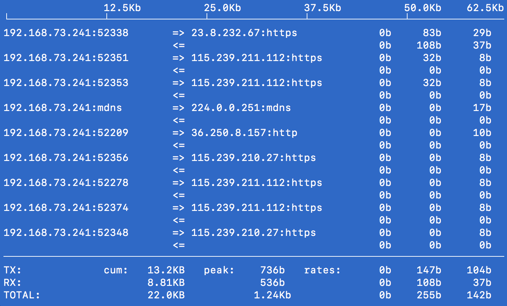
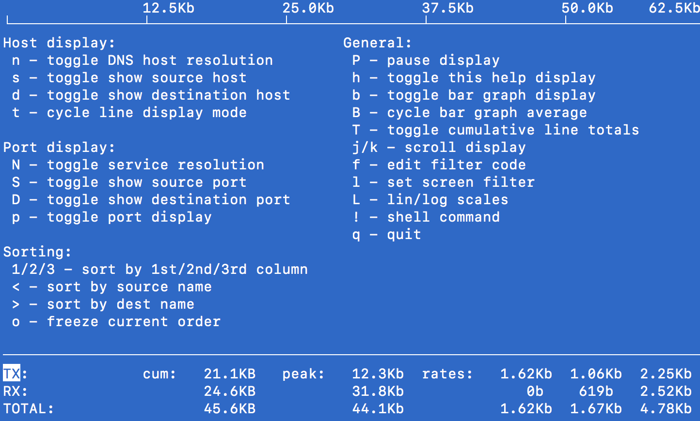


# J
# K
# L
# M
# N

## ncdu命令 （Linux Mac）
```
ncdu 命令可以用来查看和分析 Linux/Mac 中各目录对磁盘空间占用情况的工具

使用方法：   ncdu   【显示当前shell路径内文件 文件夹的大小】按键N-----以name进行排序显示
按键S-----以size大小进行排序显示
```
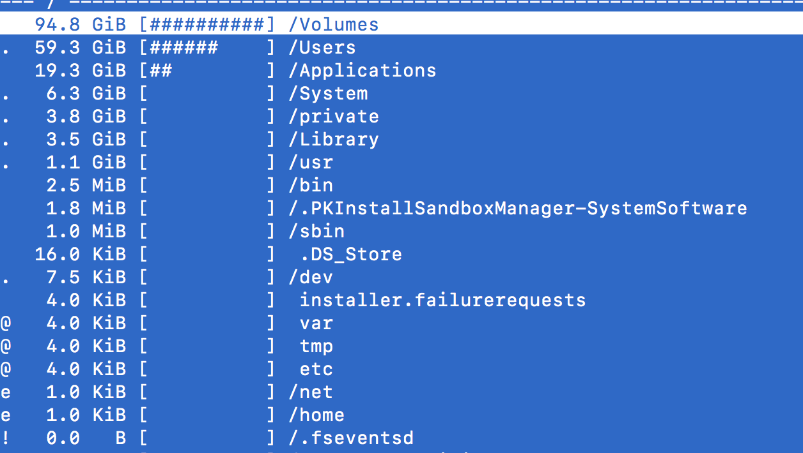

# O
# P

## PS宏   Shell脚本提示符
```
echo $PS1
${ret_status} %{$fg[cyan]%}%c%{$reset_color%} $(git_prompt_info)

【设置显示的样式】
PS1="[XXXXX的MacPro-\`pwd\`]${ret_status} %{$fg[cyan]%}%c%{$reset_color%} $(git_prompt_info)"    【普通权限下显示】

PS1="[\h]\t:\w\$"            //  【root 权限下才能正常显示】
PS1="[XXX的MacPro] \t:\w\$"       //  【root 权限下才能正常显示】

[zhuzhengjiedeMacBook-Pro]10:13:41:~$        // 【  PS1="[\h]\t:\w\$"   显示】
[XXX的MacPro] 10:14:28:~$                   // 【 PS1="[XXX的MacPro] \t:\w\$"   显示】
[XXXXX的MacPro-/Users/aaa]➜  ~            //【脚本提示显示】

```

# Q
# R
# S

## source 命令
```

source .bashrc       //立即更新环境变量 

```
# T
# U
# V
# W
## w命令
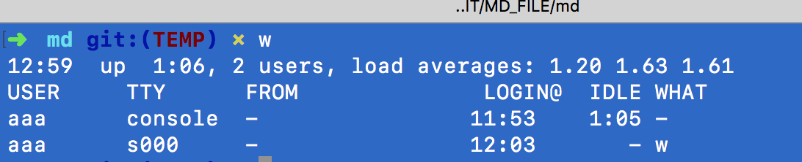

```
查看到当前登录系统的用户是谁
```
# X
# Y
## yum命令 （Linux-Shell）
```
yum 是linux环境安装软件包的一种方式   Shell前端软件包管理器
基于RPM包管理，能够从指定的服务器自动下载RPM包并且安装，可以自动处理依赖性关系，
并且一次安装所有依赖的软件包，无须繁琐地一次次下载、安装。
```
# Z

## zsh shell终端 （Mac\Linux）
```
zsh是shell的一个版本,它的功能是所有的shell版本中最为强大的一个

安装命令(Mac): brew install zsh

快捷键： 
Ctrl + D       // 拆分窗口
Ctrl +Shift +D    // 还原拆分窗口
xxx + Tab  //   可显示可能的命令
窗口 》 将窗口存储为组   【该功能可实现打开指定路径的shell】

```